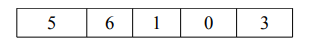
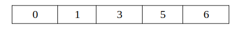

¡Hola, amigo/a programador! Bienvenidos/as a este capítulo 5 de este libro. En este capítulo hablaremos sobre los principales Algoritmos de Ordenación; veremos cómo es su estructura, funcionamiento y cómo estos nos ayudan a la hora de programar.

Los algoritmos de ordenamiento tienen una gran importancia dentro del campo de la Ciencia de la Computación porque, al momento de realizar varios procesos, necesitaremos que nuestros datos estén ordenados para poder implementar otros algoritmos. [@bustosestudio].  

En este capítulo, exploraremos algunos de los algoritmos de ordenación más conocidos y fundamentales: Burbuja (Bubble Sort), Inserción (Insertion Sort), Mergesort y Quicksort.


## **Insertion Sort**

### **Concepto**
El **Insertion Sort** (ordenación por inserción) es un algoritmo de ordenamiento simple diseñado para procesar una cantidad pequeña de elementos. Su funcionamiento técnico consiste en recorrer un arreglo desde el segundo elemento (índice 1) y compararlo, tratándolo como una "clave" (key), con los elementos precedentes. Si los elementos anteriores son mayores que la clave, el algoritmo los desplaza una posición hacia adelante para permitir la inserción del valor clave en su lugar correspondiente. Se clasifica como un algoritmo de comparación **no recursivo**, **estable** (mantiene el orden de elementos con claves iguales) y **en el lugar** (in-place), lo que significa que no requiere memoria adicional significativa para su ejecución. En términos de rendimiento práctico, es superior al Bubble Sort, siendo hasta 5 veces más rápido en implementaciones en Java[@freeCodeCamp2023].

---

### **Codigo en java**

```java
public static void insertionSort(int[] arr) {
    int n = arr.length;
    for (int i = 1; i < n; i++) {
        int key = arr[i];
        int j = i - 1;
        while (j >= 0 && arr[j] > key) {
            arr[j + 1] = arr[j];
            j = j - 1;
        }
        arr[j + 1] = key;
    }
}
```

#### **Explicacion del codigo**
El procedimiento inicia la iteración en el índice 1 del arreglo. El valor en la posición actual se almacena en la variable `key`. Un bucle interno retrocede por los elementos anteriores (índice `j`); mientras estos sean mayores que la clave, se desplazan una posición a la derecha. Finalmente, la clave se inserta en la posición vacía generada.

#### **complejidad del algoritmo**
*   **Temporal (Peor y promedio):** $O(n^2)$, ocurre cuando el arreglo está ordenado de forma inversa o aleatoria.
*   **Temporal (Mejor caso):** $O(n)$, sucede cuando el arreglo ya se encuentra ordenado, requiriendo solo una pasada.
*   **Espacial:** $O(1)$, ya que las operaciones de ordenamiento se ejecutan directamente sobre el arreglo original (in-place).

#### **Ejemplo**
Dado el arreglo inicial :

1.  **Paso 1:** Clave = 3. Como $8 > 3$, el 8 se mueve a la derecha. 
2.  **Paso 2:** Clave = 5. Como $8 > 5$, el 8 se mueve a la derecha. 
3.  **Paso 3:** Clave = 1. Se desplazan consecutivamente 8, 5 y 3 para insertar el 1 al inicio.

---

### **Código en python**

```python
def insertion_sort(arr):
    for i in range(1, len(arr)):
        key = arr[i]
        j = i - 1
        while j >= 0 and key < arr[j]:
            arr[j + 1] = arr[j]
            j -= 1
        arr[j + 1] = key
```

#### **Explicacion del codigo**
La implementación en Python utiliza un ciclo `for` para recorrer la lista y un ciclo `while` para realizar los desplazamientos necesarios hacia la derecha. Esta técnica es fundamental en algoritmos modernos como el **Timsort**, que es una mezcla de Insertion Sort y Merge Sort utilizada por defecto en las funciones de ordenamiento nativas de Python.

#### **complejidad del algoritmo**
Mantiene una complejidad temporal de **$O(n^2)$** en casos desfavorables. Es un algoritmo **estable**, garantizando que no se altere el orden relativo de elementos que posean valores idénticos.

#### **Ejemplo**
En una lista, al procesar la clave 5:

1.  Se compara 5 con 8. Dado que $8 > 5$, el 8 se desplaza.
2.  Se compara 5 con 4. Dado que $4 < 5$, el desplazamiento se detiene y el 5 se inserta en la posición inmediatamente posterior al 4.

---

### **Codigo en javascript**

```javascript
function insertionSort(arr) {
  for (let i = 1; i < arr.length; i++) {
    let key = arr[i];
    let j = i - 1;
    while (j >= 0 && arr[j] > key) {
      arr[j + 1] = arr[j];
      j--;
    }
    arr[j + 1] = key;
  }
  return arr;
}
```

#### **Explicacion del codigo**
El algoritmo itera desde la segunda posición del arreglo, extrayendo el elemento clave y comparándolo de forma regresiva con los elementos ya procesados a su izquierda. Los elementos se desplazan hacia la derecha hasta localizar el punto de inserción exacto para la clave.

#### **complejidad del algoritmo**
La complejidad temporal promedio es **$O(n^2)$**, lo que lo hace menos eficiente para grandes conjuntos de datos en comparación con algoritmos de orden $O(n \log n)$. No obstante, su bajo consumo de recursos (espacio **$O(1)$**) lo hace adecuado para sistemas con limitaciones de memoria.

#### **Ejemplo**
Con el arreglo:

1.  La clave 1 se compara con 6, 4, 3 y 2 consecutivamente.
2.  Cada uno de estos elementos se desplaza un lugar a la derecha.
3.  El 1 se inserta en el índice 0, resultando en la lista final ordenada:.


## Burbuja (Bubble Sort)

### Concepto

El método de burbuja o Bubble Sort es uno de los más simples y fáciles de comprender, ya que su función es comparar todos los elementos de una lista entre sí; su condición es que, si uno es mayor o menor que el otro, intercambien su posición.

El recorrido de la lista se repite hasta que no se necesiten más intercambios, lo que indica que la lista está ordenada. El número de repeticiones suele ser proporcional al tamaño de la lista; es decir, cuanto mayor sea el número de elementos, mayor será el número de pasadas necesarias. Aunque este algoritmo sea simple, es demasiado lento y poco práctico para la mayoría de los problemas; sin embargo, puede ser útil si la entrada ya está casi ordenada o es pequeña. Su rendimiento es crítico cuando la lista se encuentra ordenada en el orden inverso al requerido. @joaquin2014algoritmos.

### Implementación en Java

A continuación, implementaremos `bubble_sort` en Java.

```java
public  class  BubbleSort { 

 public  static  void  main (String[] args) { 
     int nums[] = { 5 , 1 , 6 , 2 , 4 , 3 }; 
     int  size  = nums.length; 
     int  temp  =  0 ; 
     
     System.out.println( "antes de ordenar" ); 
    
     for ( int num : nums){                                           
         System.out.print(num + " ");      //imprimiendo array
      } 
    
        System.out.println();   
       for ( int  i  =  0 ; i < size; i++) { 
        for ( int  j  =  0 ; j < size - i - 1 ; j++) { 
            if (nums[j] > nums[j + 1 ]) { 
                temp = nums[j]; 
                nums[j] = nums[j + 1 ]; 
                nums[j + 1 ] = temp; // Intercambio de elementos
             } 
          } 
       } 
     System.out.println( "después de ordenar" ); 
    
     for ( int num : nums){                              
       
          System.out.print(num + " " ); //imprimiendo el array
      } 
  } 

}
```
### Implementacion en Python
```python
# Definimos la lista de números
nums = [5, 1, 6, 2, 4, 3]
size = len(nums)
temp = 0

print("antes de ordenar")

# Imprimiendo el array original
for num in nums:
    print(num)

print() # Espacio en blanco

# Lógica del Ordenamiento Burbuja
for i in range(size):
    for j in range(0, size - i - 1):
        if nums[j] > nums[j + 1]:
            # Intercambio de elementos usando la variable temp
            temp = nums[j]
            nums[j] = nums[j + 1]
            nums[j + 1] = temp

print("después de ordenar")

# Imprimiendo el array ordenado
for num in nums:
    print(num)
```

### Implementacion en JavaScript
```javascript
// Definimos el arreglo de números
let nums = [5, 1, 6, 2, 4, 3];
let size = nums.length;
let temp = 0;

console.log("antes de ordenar");

// Imprimiendo el array original
for (let num of nums) {
    console.log(num);
}

console.log(""); // Espacio en blanco

// Lógica del Ordenamiento Burbuja
for (let i = 0; i < size; i++) {
    for (let j = 0; j < size - i - 1; j++) {
        if (nums[j] > nums[j + 1]) {
            // Intercambio de elementos usando la variable temp
            temp = nums[j];
            nums[j] = nums[j + 1];
            nums[j + 1] = temp;
        }
    }
}

console.log("después de ordenar");

// Imprimiendo el array ordenado
for (let num of nums) {
    console.log(num);
}
```
### Explicación del Código (Java)

1.  **`int nums[] = { 5, 1, 6, 2, 4, 3 };`**: Creamos un arreglo de numeros enteros de forma desordenada.
2.  **`int size = nums.length;`**: Guardamos el tamaño de la lista .
3.  **`int temp = 0;`**: Crearemos una variable vacia que va a servir como un auxiliar cuando nesecesitemos intercambiar dos números de lugar .
4.  **`for (int num : nums) { System.out.println(num);}:`**: Este bucle recorrera la lista completa y mostrara tal como esta nuestro arreglo
5.  **`for (int i = 0; i < size; i++)`**: Este primer bucle controlara cuántas veces se necesita revisar la lista completa, cada vez que termina una vuelta, el numero mas grande habra llegado a su posición final
6.  **`for (int j = 0; j < size - i - 1; j++)`**: En este segundo bucle va a comparar cada número vecino de dos en dos comparando el actual con el siguiente
7.  **`if (nums[j] > nums[j + 1])`**: Compara si el elemento actual es mayor que el siguiente. Si lo es, están en el orden incorrecto y se movera para que el menor sea primero.
8.  **`temp = nums[j];`**: El numero se guardara en la variable auxiliar
9.  **`nums[j] = nums[j + 1]`**: Toma el valor que esta en la derecha y le haze una copia en la posicion izquierda.
10.  **`nums[j + 1] = temp;`**: Se añade el numero que se guardo en la variable auxiliar en lugar del segundo
11.  **`for (int num : nums) { System.out.println(num); }`**: La función devuelve el arreglo ordenado.

### Complejidad

*   **Tiempo**:
    *   **Peor caso**: O(n^2). Ocurre al momento de listar al reves, en el ejercicio esto ocurre al momento de crear el arreglo
    *   **Caso promedio**: O(n^2). El programa va a realizar las comparaciones de los dos ciclos por completo, como son 6 numeros nos daria aproximadamente 36 comparaciones
    
### Ejemplo
Ordene el siguiente arreglo de menor a mayor por el metodo de la burbuja 
<center>

</center>

Implementaremos el metodo de burbuja para poder resolver nuestro problema

```java
public class Ejemplo {

    public static void main(String[] args) {
        int nums[] = {5, 6, 1, 0, 3};
        int size = nums.length;
        int temp = 0;
        for (int i = 0; i < size; i++) {
            for (int j = 0; j < size - i - 1; j++) {
                if (nums[j] > nums[j + 1]) {
                    temp = nums[j];
                    nums[j] = nums[j + 1];
                    nums[j + 1] = temp;
                }
            }
        }
        for (int num : nums) {

            System.out.print(num + " " );

        }

    }
}

```
Como nos pide que ordenemos de menor a mayor nuestra funcion comparara todos los valores de izquierda a derecha comenzando por el número 5, después con el 6, el 1, el 0 y el 3, si el número actual es mayor que el de su derecha intercambiara su posición con su vecino y seguira asi en bucle hasta que los valores de su derecha no sean mayores que los de su izquierda, dandonos como resultado sus valores ordenados 

<center>

</center>

### Implementación en Python
```python
nums = [5, 6, 1, 0, 3]
size = len(nums)

for i in range(size):
    for j in range(0, size - i - 1):
        if nums[j] > nums[j + 1]:
            nums[j], nums[j + 1] = nums[j + 1], nums[j]


for num in nums:
    print(num, end=" ")
    
```
### Implementación en JavaScript
``` javascript
let nums = [5, 6, 1, 0, 3];
let size = nums.length;
let temp = 0;

for (let i = 0; i < size; i++) {
    for (let j = 0; j < size - i - 1; j++) {
        if (nums[j] > nums[j + 1]) {
            temp = nums[j];
            nums[j] = nums[j + 1];
            nums[j + 1] = temp;
        }
    }
}

console.log(nums.join(" "));
```
## Inserción (Insertion Sort)

### Concepto

El algoritmo de ordenación por inserción funciona de manera similar a cómo ordenaríamos un mazo de cartas en nuestra mano. Recorremos la lista elemento por elemento, tomando cada elemento y "insertándolo" en la posición correcta dentro de la parte ya ordenada de la lista.

La lista se divide conceptualmente en dos partes: una sublista ordenada (inicialmente solo el primer elemento) y el resto de elementos desordenados. En cada paso, se toma el primer elemento de la parte desordenada y se compara con los elementos de la sublista ordenada, desplazando los elementos mayores que él para hacer espacio y luego insertándolo en su posición correcta.

### Implementación en R

Implementaremos `insertion_sort` en R.

```{r}
insertion_sort <- function(arr) {
  n <- length(arr)
  
  # Itera desde el segundo elemento hasta el final
  for (i in 2:n) {
    key <- arr[i] # Elemento actual a insertar
    j <- i - 1     # Índice del último elemento de la sublista ordenada
    
    # Mueve los elementos de arr[0..i-1], que son mayores que key,
    # una posición adelante de su posición actual
    while (j >= 1 && arr[j] > key) {
      arr[j + 1] <- arr[j]
      j <- j - 1
    }
    
    # Inserta key en su posición correcta
    arr[j + 1] <- key
  }
  return(arr)
}
```

### Explicación del Código

1.  **`insertion_sort(arr)`**: Nuestra función toma un vector `arr` como entrada.
2.  **`n <- length(arr)`**: Obtenemos la longitud del vector.
3.  **`for (i in 2:n)`**: Este bucle exterior comienza desde el segundo elemento (`i=2`) porque asumimos que el primer elemento (`arr[1]`) ya es una sublista ordenada de un solo elemento.
4.  **`key <- arr[i]`**: `key` es el elemento actual que queremos insertar en la sublista ordenada.
5.  **`j <- i - 1`**: `j` es el índice del último elemento de la sublista ya ordenada.
6.  **`while (j >= 1 && arr[j] > key)`**: Este bucle `while` se encarga de:
    *   Comparar `key` con los elementos de la sublista ordenada (`arr[j]`).
    *   Si un elemento `arr[j]` es mayor que `key`, lo desplaza una posición a la derecha (`arr[j + 1] <- arr[j]`).
    *   `j` se decrementa para moverse hacia el inicio de la sublista ordenada, buscando el lugar correcto para `key`.
7.  **`arr[j + 1] <- key`**: Una vez que el bucle `while` termina (ya sea porque `j` llegó a 0 o porque `arr[j]` es menor o igual que `key`), significa que `j + 1` es la posición correcta para insertar `key`.
8.  **`return(arr)`**: La función devuelve el vector ordenado.

### Complejidad

*   **Tiempo**:
    *   **Peor caso**: O(n^2). Ocurre cuando el array está ordenado en orden inverso. Cada elemento debe ser comparado y desplazado a través de casi toda la sublista ordenada.
    *   **Caso promedio**: O(n^2).
    *   **Mejor caso**: O(n). Si el array ya está ordenado, cada elemento se compara solo con el elemento adyacente anterior, lo que resulta en un tiempo lineal.
*   **Espacio**: O(1). Es un algoritmo "in-place".

### Ejemplo

Veamos `insertion_sort` en acción.

```{r}
# Ejemplo 1: Un vector desordenado
vector_desordenado <- c(12, 11, 13, 5, 6)
print(paste("Vector original:", paste(vector_desordenado, collapse = ", ")))
vector_ordenado <- insertion_sort(vector_desordenado)
print(paste("Vector ordenado (Insertion Sort):", paste(vector_ordenado, collapse = ", ")))

# Ejemplo 2: Un vector pequeño
vector_pequeño <- c(4, 1, 3, 2)
print(paste("Vector pequeño:", paste(vector_pequeño, collapse = ", ")))
vector_ordenado_p <- insertion_sort(vector_pequeño)
print(paste("Vector ordenado (Insertion Sort):", paste(vector_ordenado_p, collapse = ", ")))
```

## Mergesort

### Concepto

Mergesort es un algoritmo de ordenación eficiente y estable que sigue el paradigma "divide y vencerás". Su principio es dividir el array de entrada en dos mitades, ordenar cada mitad recursivamente, y luego combinar (fusionar) las dos mitades ordenadas para producir el array final ordenado.

Los pasos principales son:
1.  **Dividir**: Si la lista tiene más de un elemento, divídela en dos sublistas aproximadamente iguales.
2.  **Conquistar**: Ordena recursivamente cada sublista utilizando Mergesort.
3.  **Combinar (Merge)**: Fusiona las dos sublistas ordenadas en una única lista ordenada. La fase de combinación es donde ocurre la mayor parte del trabajo.

La recursión termina cuando la sublista tiene un solo elemento, ya que una lista de un solo elemento se considera ordenada por definición.

### Implementación en R

Necesitaremos dos funciones: una para la lógica recursiva de división (`merge_sort`) y otra para la combinación de dos arrays ya ordenados (`merge_arrays`).

```{r}
# Función para combinar dos sub-arrays ordenados
merge_arrays <- function(left, right) {
  result <- c()
  
  # Mientras ambos arrays tengan elementos
  while (length(left) > 0 && length(right) > 0) {
    if (left[1] <= right[1]) {
      result <- c(result, left[1])
      left <- left[-1] # Elimina el primer elemento
    } else {
      result <- c(result, right[1])
      right <- right[-1] # Elimina el primer elemento
    }
  }
  
  # Añade los elementos restantes, si los hay
  if (length(left) > 0) {
    result <- c(result, left)
  }
  if (length(right) > 0) {
    result <- c(result, right)
  }
  
  return(result)
}

# Función principal de Mergesort
merge_sort <- function(arr) {
  n <- length(arr)
  
  # Caso base: un array con 0 o 1 elemento ya está ordenado
  if (n <= 1) {
    return(arr)
  }
  
  # Divide el array en dos mitades
  mid <- floor(n / 2)
  left_half <- arr[1:mid]
  right_half <- arr[(mid + 1):n]
  
  # Ordena recursivamente cada mitad
  sorted_left <- merge_sort(left_half)
  sorted_right <- merge_sort(right_half)
  
  # Combina las mitades ordenadas
  return(merge_arrays(sorted_left, sorted_right))
}
```

### Explicación del Código

#### `merge_arrays(left, right)`:
1.  **`result <- c()`**: Inicializamos un vector vacío para almacenar el resultado combinado.
2.  **`while (length(left) > 0 && length(right) > 0)`**: Este bucle compara los primeros elementos de `left` y `right`.
    *   El elemento más pequeño se añade a `result` y se elimina de su array original usando `left[-1]` o `right[-1]`. **Nota**: La eliminación de elementos al inicio de un vector en R es una operación costosa O(n) que puede impactar el rendimiento real de esta implementación en R. En lenguajes de bajo nivel se usarían punteros o índices.
3.  **`if (length(left) > 0)` / `if (length(right) > 0)`**: Después del bucle `while`, uno de los arrays podría tener elementos restantes (porque uno se agotó antes que el otro). Estos elementos restantes ya están ordenados y simplemente se añaden al final de `result`.
4.  **`return(result)`**: Devuelve el array combinado y ordenado.

#### `merge_sort(arr)`:
1.  **`n <- length(arr)`**: Obtiene la longitud del array.
2.  **`if (n <= 1)`**: Este es el **caso base** de la recursión. Si el array tiene 0 o 1 elemento, ya está ordenado, así que lo devolvemos tal cual.
3.  **`mid <- floor(n / 2)`**: Calcula el punto medio para dividir el array.
4.  **`left_half <- arr[1:mid]` y `right_half <- arr[(mid + 1):n]`**: Crea las dos sub-mitades del array.
5.  **`sorted_left <- merge_sort(left_half)` y `sorted_right <- merge_sort(right_half)`**: Llama recursivamente a `merge_sort` en cada mitad hasta que se alcanzan los casos base (arrays de un solo elemento).
6.  **`return(merge_arrays(sorted_left, sorted_right))`**: Una vez que las mitades se han ordenado recursivamente, se fusionan utilizando la función `merge_arrays`.

### Complejidad

*   **Tiempo**:
    *   **Peor caso**: O(n log n).
    *   **Caso promedio**: O(n log n).
    *   **Mejor caso**: O(n log n).
    Mergesort tiene un rendimiento consistente en todos los casos debido a su estrategia de división equitativa y la naturaleza de la operación de fusión. El factor `log n` viene de las divisiones recursivas, y `n` de la operación de fusión en cada nivel.
*   **Espacio**: O(n). Mergesort no es un algoritmo "in-place" puro. Requiere espacio adicional para almacenar las sublistas temporales durante la fase de fusión. En nuestra implementación de R, la creación de nuevos vectores en cada paso de `merge_arrays` contribuye a esta complejidad espacial.

### Ejemplo

Veamos `merge_sort` en acción.

```{r}
# Ejemplo 1: Un vector desordenado
vector_desordenado <- c(38, 27, 43, 3, 9, 82, 10)
print(paste("Vector original:", paste(vector_desordenado, collapse = ", ")))
vector_ordenado <- merge_sort(vector_desordenado)
print(paste("Vector ordenado (Mergesort):", paste(vector_ordenado, collapse = ", ")))

# Ejemplo 2: Un vector con elementos duplicados
vector_duplicados <- c(5, 2, 8, 2, 1, 5, 9)
print(paste("Vector con duplicados:", paste(vector_duplicados, collapse = ", ")))
vector_ordenado_dup <- merge_sort(vector_duplicados)
print(paste("Vector ordenado (Mergesort):", paste(vector_ordenado_dup, collapse = ", ")))
```

## Quicksort

### Concepto

Quicksort es otro algoritmo de ordenación eficiente basado en el paradigma "divide y vencerás". Es considerado uno de los algoritmos de ordenación más rápidos en la práctica para grandes conjuntos de datos no estructurados.

El funcionamiento básico es el siguiente:
1.  **Elegir un Pivote**: Selecciona un elemento del array, llamado "pivote". La elección del pivote es crucial para el rendimiento.
2.  **Particionar**: Reordena el array de modo que todos los elementos con valores menores que el pivote queden a su izquierda, y todos los elementos con valores mayores queden a su derecha. Los elementos iguales al pivote pueden ir a cualquiera de los dos lados. Después de la partición, el pivote está en su posición final ordenada.
3.  **Recursión**: Aplica Quicksort recursivamente a la sublista de elementos con valores menores que el pivote y a la sublista de elementos con valores mayores que el pivote.

La recursión termina cuando una sublista tiene cero o un elemento, ya que ya están ordenados.

### Implementación en R

Implementaremos `quick_sort` en R. Esta implementación es una versión simplificada que crea nuevos vectores en cada paso de la partición, lo cual es más idiomático en R pero menos eficiente en espacio que una implementación "in-place" con punteros.

```{r}
quick_sort <- function(arr) {
  n <- length(arr)
  
  # Caso base: un array con 0 o 1 elemento ya está ordenado
  if (n <= 1) {
    return(arr)
  }
  
  # Elegir un pivote. Aquí usamos el último elemento por simplicidad.
  # Otras estrategias incluyen elegir el primero, el del medio, o un pivote aleatorio.
  pivot_index <- n
  pivot <- arr[pivot_index]
  
  # Separar los elementos menores y mayores que el pivote
  # Excluimos el pivote del array original antes de la partición
  remaining_elements <- arr[-pivot_index]
  
  # Utilizar un enfoque R-idiomático para la partición
  # Esto crea nuevos vectores, lo que impacta la eficiencia espacial
  less <- remaining_elements[remaining_elements < pivot]
  greater <- remaining_elements[remaining_elements >= pivot] # >= para incluir iguales o mayores
  
  # Ordenar recursivamente las sublistas y combinar
  return(c(quick_sort(less), pivot, quick_sort(greater)))
}
```

### Explicación del Código

1.  **`quick_sort(arr)`**: Nuestra función toma un vector `arr`.
2.  **`if (n <= 1)`**: El **caso base** de la recursión. Si el array tiene 0 o 1 elemento, se devuelve tal cual.
3.  **`pivot_index <- n` / `pivot <- arr[pivot_index]`**: Elegimos el último elemento como pivote. Esta es una elección simple, pero puede llevar al peor caso si el array ya está ordenado o casi ordenado.
4.  **`remaining_elements <- arr[-pivot_index]`**: Creamos un nuevo vector que contiene todos los elementos excepto el pivote.
5.  **`less <- remaining_elements[remaining_elements < pivot]`**: Filtra los elementos de `remaining_elements` que son menores que el pivote.
6.  **`greater <- remaining_elements[remaining_elements >= pivot]`**: Filtra los elementos que son mayores o iguales que el pivote. Es importante incluir los iguales para evitar bucles infinitos en casos con duplicados si solo se usara `>` y el pivote fuera único.
7.  **`return(c(quick_sort(less), pivot, quick_sort(greater)))`**: Esta es la fase de combinación.
    *   Llama recursivamente a `quick_sort` en la sublista `less`.
    *   El `pivot` se coloca en medio, ya que está en su posición final.
    *   Llama recursivamente a `quick_sort` en la sublista `greater`.
    *   `c()` concatena estos tres resultados en el array final ordenado.

### Complejidad

*   **Tiempo**:
    *   **Peor caso**: O(n^2). Ocurre cuando la elección del pivote es consistentemente mala (por ejemplo, siempre el elemento más pequeño o más grande), lo que resulta en particiones desequilibradas (una sublista de `n-1` elementos y otra de 0).
    *   **Caso promedio**: O(n log n). Con una buena elección de pivote (que divide el array en dos subproblemas de tamaño similar), Quicksort es muy eficiente.
    *   **Mejor caso**: O(n log n).
*   **Espacio**:
    *   **Caso promedio**: O(log n). Esto se debe al espacio utilizado por la pila de recursión para almacenar las llamadas a la función.
    *   **Peor caso**: O(n). Si las particiones son muy desequilibradas, la pila de recursión puede crecer linealmente con el tamaño de `n`.
    *   Nuestra implementación en R, al crear nuevos vectores `less` y `greater` en cada llamada, tiene una complejidad espacial mayor en la práctica que una implementación "in-place" típica de Quicksort, que solo usa espacio para la pila de recursión.

### Ejemplo

Veamos `quick_sort` en acción.

```{r}
# Ejemplo 1: Un vector desordenado
vector_desordenado <- c(10, 80, 30, 90, 40, 50, 70)
print(paste("Vector original:", paste(vector_desordenado, collapse = ", ")))
vector_ordenado <- quick_sort(vector_desordenado)
print(paste("Vector ordenado (Quicksort):", paste(vector_ordenado, collapse = ", ")))

# Ejemplo 2: Un vector con números negativos
vector_negativos <- c(-5, 3, -1, 8, 0, -10)
print(paste("Vector con negativos:", paste(vector_negativos, collapse = ", ")))
vector_ordenado_neg <- quick_sort(vector_negativos)
print(paste("Vector ordenado (Quicksort):", paste(vector_ordenado_neg, collapse = ", ")))
```

## Conclusión

Hemos recorrido cuatro algoritmos de ordenación fundamentales, cada uno con su enfoque único y características de rendimiento.

*   **Bubble Sort** e **Insertion Sort** son algoritmos simples de entender e implementar, adecuados para arrays pequeños o casi ordenados (donde rinden en O(n)). Sin embargo, su complejidad de O(n^2) los hace imprácticos para grandes volúmenes de datos.
*   **Mergesort** y **Quicksort** son algoritmos de "divide y vencerás" que ofrecen un rendimiento mucho mejor, generalmente O(n log n).
    *   **Mergesort** es estable y tiene un rendimiento consistente de O(n log n) en todos los casos, pero requiere O(n) de espacio adicional.
    *   **Quicksort** es típicamente el más rápido en la práctica (O(n log n) promedio), especialmente en implementaciones "in-place", aunque su peor caso es O(n^2) y puede ser inestable. La elección del pivote es crítica para su eficiencia.

En R, para tareas de ordenación cotidianas, generalmente se recomienda usar las funciones nativas optimizadas como `sort()` o `order()`, ya que están implementadas en C/Fortran y son extremadamente eficientes. Sin embargo, comprender los algoritmos subyacentes es crucial para cualquier científico de datos o programador que desee escribir código eficiente y comprender las bases de la informática. ¡Espero que este capítulo le haya proporcionado una base sólida!