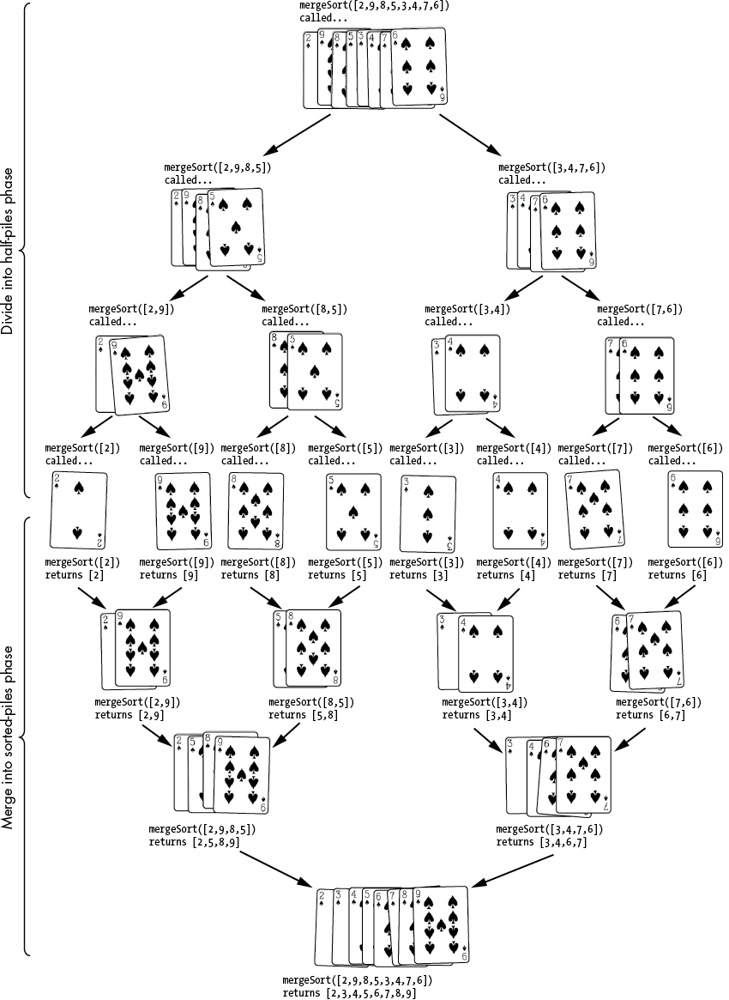

¡Hola, amigo/a programador! Bienvenidos/as a este capítulo 5 de este libro. En este capítulo hablaremos sobre los principales Algoritmos de Ordenación; veremos cómo es su estructura, funcionamiento y cómo estos nos ayudan a la hora de programar.

Los algoritmos de ordenamiento tienen una gran importancia dentro del campo de la Ciencia de la Computación porque, al momento de realizar varios procesos, necesitaremos que nuestros datos estén ordenados para poder implementar otros algoritmos. [@bustosestudio].  

En este capítulo, exploraremos algunos de los algoritmos de ordenación más conocidos y fundamentales: Burbuja (Bubble Sort), Inserción (Insertion Sort), Mergesort y Quicksort.


## Burbuja (Bubble Sort)

### Concepto

El método de burbuja o Bubble Sort es uno de los más simples y fáciles de comprender, ya que su función es comparar todos los elementos de una lista entre sí; su condición es que, si uno es mayor o menor que el otro, intercambien su posición.

El recorrido de la lista se repite hasta que no se necesiten más intercambios, lo que indica que la lista está ordenada. El número de repeticiones suele ser proporcional al tamaño de la lista; es decir, cuanto mayor sea el número de elementos, mayor será el número de pasadas necesarias. Aunque este algoritmo sea simple, es demasiado lento y poco práctico para la mayoría de los problemas; sin embargo, puede ser útil si la entrada ya está casi ordenada o es pequeña. Su rendimiento es crítico cuando la lista se encuentra ordenada en el orden inverso al requerido. @joaquin2014algoritmos.

### Implementación en Java

A continuación, implementaremos `bubble_sort` en Java.

```java
public  class  BubbleSort { 

 public  static  void  main (String[] args) { 
     int nums[] = { 5 , 1 , 6 , 2 , 4 , 3 }; 
     int  size  = nums.length; 
     int  temp  =  0 ; 
     
     System.out.println( "antes de ordenar" ); 
    
     for ( int num : nums){                                           
         System.out.print(num + " ");      //imprimiendo array
      } 
    
        System.out.println();   
       for ( int  i  =  0 ; i < size; i++) { 
        for ( int  j  =  0 ; j < size - i - 1 ; j++) { 
            if (nums[j] > nums[j + 1 ]) { 
                temp = nums[j]; 
                nums[j] = nums[j + 1 ]; 
                nums[j + 1 ] = temp; // Intercambio de elementos
             } 
          } 
       } 
     System.out.println( "después de ordenar" ); 
    
     for ( int num : nums){                              
       
          System.out.print(num + " " ); //imprimiendo el array
      } 
  } 

}
```
### Implementacion en Python
```python
# Definimos la lista de números
nums = [5, 1, 6, 2, 4, 3]
size = len(nums)
temp = 0

print("antes de ordenar")

# Imprimiendo el array original
for num in nums:
    print(num)

print() # Espacio en blanco

# Lógica del Ordenamiento Burbuja
for i in range(size):
    for j in range(0, size - i - 1):
        if nums[j] > nums[j + 1]:
            # Intercambio de elementos usando la variable temp
            temp = nums[j]
            nums[j] = nums[j + 1]
            nums[j + 1] = temp

print("después de ordenar")

# Imprimiendo el array ordenado
for num in nums:
    print(num)
```

### Implementacion en JavaScript
```javascript
// Definimos el arreglo de números
let nums = [5, 1, 6, 2, 4, 3];
let size = nums.length;
let temp = 0;

console.log("antes de ordenar");

// Imprimiendo el array original
for (let num of nums) {
    console.log(num);
}

console.log(""); // Espacio en blanco

// Lógica del Ordenamiento Burbuja
for (let i = 0; i < size; i++) {
    for (let j = 0; j < size - i - 1; j++) {
        if (nums[j] > nums[j + 1]) {
            // Intercambio de elementos usando la variable temp
            temp = nums[j];
            nums[j] = nums[j + 1];
            nums[j + 1] = temp;
        }
    }
}

console.log("después de ordenar");

// Imprimiendo el array ordenado
for (let num of nums) {
    console.log(num);
}
```
### Explicación del Código (Java)

1.  **`int nums[] = { 5, 1, 6, 2, 4, 3 };`**: Creamos un arreglo de numeros enteros de forma desordenada.
2.  **`int size = nums.length;`**: Guardamos el tamaño de la lista .
3.  **`int temp = 0;`**: Crearemos una variable vacia que va a servir como un auxiliar cuando nesecesitemos intercambiar dos números de lugar .
4.  **`for (int num : nums) { System.out.println(num);}:`**: Este bucle recorrera la lista completa y mostrara tal como esta nuestro arreglo
5.  **`for (int i = 0; i < size; i++)`**: Este primer bucle controlara cuántas veces se necesita revisar la lista completa, cada vez que termina una vuelta, el numero mas grande habra llegado a su posición final
6.  **`for (int j = 0; j < size - i - 1; j++)`**: En este segundo bucle va a comparar cada número vecino de dos en dos comparando el actual con el siguiente
7.  **`if (nums[j] > nums[j + 1])`**: Compara si el elemento actual es mayor que el siguiente. Si lo es, están en el orden incorrecto y se movera para que el menor sea primero.
8.  **`temp = nums[j];`**: El numero se guardara en la variable auxiliar
9.  **`nums[j] = nums[j + 1]`**: Toma el valor que esta en la derecha y le haze una copia en la posicion izquierda.
10.  **`nums[j + 1] = temp;`**: Se añade el numero que se guardo en la variable auxiliar en lugar del segundo
11.  **`for (int num : nums) { System.out.println(num); }`**: La función devuelve el arreglo ordenado.

### Complejidad

*   **Tiempo**:
    *   **Peor caso**: O(n^2). Ocurre al momento de listar al reves, en el ejercicio esto ocurre al momento de crear el arreglo
    *   **Caso promedio**: O(n^2). El programa va a realizar las comparaciones de los dos ciclos por completo, como son 6 numeros nos daria aproximadamente 36 comparaciones
    
### Ejemplo
Ordene el siguiente arreglo de menor a mayor por el metodo de la burbuja 
<center>

</center>

Implementaremos el metodo de burbuja para poder resolver nuestro problema

```java
public class Ejemplo {

    public static void main(String[] args) {
        int nums[] = {5, 6, 1, 0, 3};
        int size = nums.length;
        int temp = 0;
        for (int i = 0; i < size; i++) {
            for (int j = 0; j < size - i - 1; j++) {
                if (nums[j] > nums[j + 1]) {
                    temp = nums[j];
                    nums[j] = nums[j + 1];
                    nums[j + 1] = temp;
                }
            }
        }
        for (int num : nums) {

            System.out.print(num + " " );

        }

    }
}

```
Como nos pide que ordenemos de menor a mayor nuestra funcion comparara todos los valores de izquierda a derecha comenzando por el número 5, después con el 6, el 1, el 0 y el 3, si el número actual es mayor que el de su derecha intercambiara su posición con su vecino y seguira asi en bucle hasta que los valores de su derecha no sean mayores que los de su izquierda, dandonos como resultado sus valores ordenados 

<center>

</center>

### Implementación en Python
```python
nums = [5, 6, 1, 0, 3]
size = len(nums)

for i in range(size):
    for j in range(0, size - i - 1):
        if nums[j] > nums[j + 1]:
            nums[j], nums[j + 1] = nums[j + 1], nums[j]


for num in nums:
    print(num, end=" ")
    
```
### Implementación en JavaScript
``` javascript
let nums = [5, 6, 1, 0, 3];
let size = nums.length;
let temp = 0;

for (let i = 0; i < size; i++) {
    for (let j = 0; j < size - i - 1; j++) {
        if (nums[j] > nums[j + 1]) {
            temp = nums[j];
            nums[j] = nums[j + 1];
            nums[j + 1] = temp;
        }
    }
}

console.log(nums.join(" "));
```

## **Insertion Sort**

### **Concepto**
El **Insertion Sort** (ordenación por inserción) es un algoritmo de ordenamiento simple diseñado para procesar una cantidad pequeña de elementos. Su funcionamiento técnico consiste en recorrer un arreglo desde el segundo elemento (índice 1) y compararlo, tratándolo como una "clave" (key), con los elementos precedentes. Si los elementos anteriores son mayores que la clave, el algoritmo los desplaza una posición hacia adelante para permitir la inserción del valor clave en su lugar correspondiente. Se clasifica como un algoritmo de comparación **no recursivo**, **estable** (mantiene el orden de elementos con claves iguales) y **en el lugar** (in-place), lo que significa que no requiere memoria adicional significativa para su ejecución. En términos de rendimiento práctico, es superior al Bubble Sort, siendo hasta 5 veces más rápido en implementaciones en Java[@freeCodeCamp2023].

En este capítulo, exploraremos algunos de los algoritmos de ordenación más conocidos y fundamentales: Burbuja (Bubble Sort), Inserción (Insertion Sort), Mergesort y Quicksort. Analizaremos su funcionamiento, implementaremos cada uno en R con bloques de código ejecutables y discutiremos sus características de rendimiento, incluyendo su complejidad temporal y espacial.

### **Codigo en java**

```java
public static void insertionSort(int[] arr) {
    int n = arr.length;
    for (int i = 1; i < n; i++) {
        int key = arr[i];
        int j = i - 1;
        while (j >= 0 && arr[j] > key) {
            arr[j + 1] = arr[j];
            j = j - 1;
        }
        arr[j + 1] = key;
    }
}
```

#### **Explicacion del codigo**
El procedimiento inicia la iteración en el índice 1 del arreglo. El valor en la posición actual se almacena en la variable `key`. Un bucle interno retrocede por los elementos anteriores (índice `j`); mientras estos sean mayores que la clave, se desplazan una posición a la derecha. Finalmente, la clave se inserta en la posición vacía generada.

#### **complejidad del algoritmo**
*   **Temporal (Peor y promedio):** $O(n^2)$, ocurre cuando el arreglo está ordenado de forma inversa o aleatoria.
*   **Temporal (Mejor caso):** $O(n)$, sucede cuando el arreglo ya se encuentra ordenado, requiriendo solo una pasada.
*   **Espacial:** $O(1)$, ya que las operaciones de ordenamiento se ejecutan directamente sobre el arreglo original (in-place).

#### **Ejemplo**
Dado el arreglo inicial :

1.  **Paso 1:** Clave = 3. Como $8 > 3$, el 8 se mueve a la derecha. 
2.  **Paso 2:** Clave = 5. Como $8 > 5$, el 8 se mueve a la derecha. 
3.  **Paso 3:** Clave = 1. Se desplazan consecutivamente 8, 5 y 3 para insertar el 1 al inicio.

El algoritmo de ordenación por burbuja es uno de los más sencillos de entender e implementar. Su nombre proviene del hecho de que los elementos más "grandes" (o más "pesados", si imaginamos burbujas) "flotan" gradualmente hacia el final de la lista a medida que se realizan comparaciones y posibles intercambios.


### **Código en python**

```python
def insertion_sort(arr):
    for i in range(1, len(arr)):
        key = arr[i]
        j = i - 1
        while j >= 0 and key < arr[j]:
            arr[j + 1] = arr[j]
            j -= 1
        arr[j + 1] = key
```

#### **Explicacion del codigo**
La implementación en Python utiliza un ciclo `for` para recorrer la lista y un ciclo `while` para realizar los desplazamientos necesarios hacia la derecha. Esta técnica es fundamental en algoritmos modernos como el **Timsort**, que es una mezcla de Insertion Sort y Merge Sort utilizada por defecto en las funciones de ordenamiento nativas de Python.

#### **complejidad del algoritmo**
Mantiene una complejidad temporal de **$O(n^2)$** en casos desfavorables. Es un algoritmo **estable**, garantizando que no se altere el orden relativo de elementos que posean valores idénticos.

#### **Ejemplo**
En una lista, al procesar la clave 5:

1.  Se compara 5 con 8. Dado que $8 > 5$, el 8 se desplaza.
2.  Se compara 5 con 4. Dado que $4 < 5$, el desplazamiento se detiene y el 5 se inserta en la posición inmediatamente posterior al 4.

### **Codigo en javascript**

```javascript
function insertionSort(arr) {
  for (let i = 1; i < arr.length; i++) {
    let key = arr[i];
    let j = i - 1;
    while (j >= 0 && arr[j] > key) {
      arr[j + 1] = arr[j];
      j--;
    }
    arr[j + 1] = key;
  }
  return arr;
}
```

#### **Explicacion del codigo**
El algoritmo itera desde la segunda posición del arreglo, extrayendo el elemento clave y comparándolo de forma regresiva con los elementos ya procesados a su izquierda. Los elementos se desplazan hacia la derecha hasta localizar el punto de inserción exacto para la clave.

#### **complejidad del algoritmo**
La complejidad temporal promedio es **$O(n^2)$**, lo que lo hace menos eficiente para grandes conjuntos de datos en comparación con algoritmos de orden $O(n \log n)$. No obstante, su bajo consumo de recursos (espacio **$O(1)$**) lo hace adecuado para sistemas con limitaciones de memoria.

#### **Ejemplo**
Con el arreglo:

1.  La clave 1 se compara con 6, 4, 3 y 2 consecutivamente.
2.  Cada uno de estos elementos se desplaza un lugar a la derecha.
3.  El 1 se inserta en el índice 0, resultando en la lista final ordenada:.


## Merge Sort

### Concepto

Merge Sort es un algoritmo de ordenamiento avanzado quee se base en el pricipio de “Divide y Vencerás”, utilizado con frecuencia para sistemas que requieren alto redimiento, estabilidad y eficiencia al trabajar con grandes volúmenes de datos.[@asin2021medicion] Su principal ventaja es mantener un tiempo de ejcucion predecibles incluso cuando el tamaño de los datos aumenta. El funcionamiento del Merge Sort consiste en dividir de manera repetitiva un arreglo en partes mas pequeñas hasta obtener subproblemas de un solo elemento que se lo considera ordenado.[@gurin2004algoritmos] Posteriormente el argorroritmo empieza a mezclar de manera ordenada comparando sus elementos hasta reconstruir completamente el arreglo original, pero ahora organizado en orden ascendente. Este proceso puede imaginarse como el ordenamiento de una baraja de cartas. Si intentáramos ordenarla de manera tradicional, tendríamos que revisar varias veces las mismas cartas para determinar su posición correcta. Sin embargo, al aplicar el principio de “Divide y Vencerás”, la baraja puede dividirse en grupos más pequeños, facilitando el ordenamiento de cada parte por separado. Permitiendo que los grupos ya ordenados se vuelven a unir poco a poco hasta obtener toda la baraja organizada.

{width=70% fig-align="center"}

El algoritmo funciona siguiento tres pasos principales:

1.  **Dividir**: Si el arreglo contiene varios elemento este se divide a la mitad en dos subgrupos diferentes reduciendo el problema en partes mas pequeñas.
2.  **Vencer**: Una vez divididos en subgrupos se aplica el mismo procesos de divicion de manera recursiva a cada subgrupo hasta obtener subarreglos de un solo elemento.
3.  **Combinar (Merge)**: Finalmente todos los subarreglos se unen de forma ordenada comparando cada uno de sus elementos colocandolos en sus posicion correcta hasta formar un nuevo super arreglo.

Este proceso continúa ejecutándose de manera recursiva hasta llegar a subarreglos de un solo elemento. Debido a que cada subarreglo contiene únicamente un dato, estos se consideran ordenados. A partir de ese punto, el algoritmo comienza el proceso de mezcla y reconstrucción ordenada hasta obtener el arreglo final completamente organizado.


### Implementación en Java {width=10% fig-align="left"}

Para la realizacion de este algoritmo necesitaremos dos funciones: una para la lógica recursiva de división (`merge_sort`) y otra para la combinación de dos arrays ya ordenados (`merge_arrays`).

```java
//| eval: false
public class Mergesort {
    /*
     * Metodo encargado de combinar dos subarreglos ordenados
     * en un unico arreglo ordenado.
     */
    public void merge_arrays(int[] arr, int l, int m, int r) {

        // Tamaño del subarreglo izquierdo
        int n1 = m - l + 1;

        // Tamaño del subarreglo derecho
        int n2 = r - m;

        // Arreglos auxiliares
        int[] L = new int[n1];
        int[] R = new int[n2];

        // Copiar elementos al arreglo izquierdo
        for (int i = 0; i < n1; i++) {
            L[i] = arr[l + i];
        }

        // Copiar elementos al arreglo derecho
        for (int j = 0; j < n2; j++) {
            R[j] = arr[m + 1 + j];
        }

        // Variables de control
        int i = 0; // Indice del arreglo izquierdo
        int j = 0; // Indice del arreglo derecho
        int k = l; // Indice del arreglo principal


        //Comparar elementos de ambos arreglos y colocarlos en orden ascendente
        while (i < n1 && j < n2) {
            if (L[i] <= R[j]) {
                arr[k] = L[i];
                i++;
            } else {
                arr[k] = R[j];
                j++;
            }
            k++;
        }

        //Copiar los elementos restantes del arreglo izquierdo
        while (i < n1) {
            arr[k] = L[i];
            i++;
            k++;
        }
        //Copiar los elementos restantes del arreglo derecho
        while (j < n2) {
            arr[k] = R[j];
            j++;
            k++;
        }
    }

    /*
     * Metodo principal de Merge Sort.
     * Divide el arreglo recursivamente.
     */
    public void merge_sort(int arr[], int l, int r) {
        if (l < r) {
          
            // Calculo del punto medio
            int m = l + (r - l) / 2;
            
            // Ordenar mitad izquierda
            merge_sort(arr, l, m);
            
            // Ordenar mitad derecha
            merge_sort(arr, m + 1, r);
            
            // Combinar ambas mitades
            merge_arrays(arr, l, m, r);
        }
    }
}
```


### Implementación en Python {width=10% fig-align="left"}


```python
#| eval: false
class Mergesort:
    # Metodo encargado de combinar dos subarreglos ordenados en un unico arreglo ordenado.
    def merge_arrays(self, arr, l, m, r):

        # Tamaño del subarreglo izquierdo
        n1 = m - l + 1

        # Tamaño del subarreglo derecho
        n2 = r - m

        # Arreglos auxiliares
        L = [0] * n1
        R = [0] * n2

        # Copiar elementos al arreglo izquierdo
        for i in range(n1):
            L[i] = arr[l + i]

        # Copiar elementos al arreglo derecho
        for j in range(n2):
            R[j] = arr[m + 1 + j]

        # Variables de control
        i = 0   # Indice del arreglo izquierdo
        j = 0   # Indice del arreglo derecho
        k = l   # Indice del arreglo principal
        
        #Comparar elementos de ambos arreglos y colocarlos en orden ascendente
        while i < n1 and j < n2:
            if L[i] <= R[j]:
                arr[k] = L[i]
                i += 1
            else:
                arr[k] = R[j]
                j += 1
            k += 1
        
        #Copiar los elementos restantes del arreglo izquierdo
        while i < n1:
            arr[k] = L[i]
            i += 1
            k += 1
        
        #Copiar los elementos restantes del arreglo derecho
        while j < n2:
            arr[k] = R[j]
            j += 1
            k += 1

   
    # Metodo principal de Merge Sort Divide el arreglo recursivamente.
    def merge_sort(self, arr, l, r):

        # Verifica si el arreglo puede seguir dividiendose
        if l < r:
            
            # Calculo del punto medio
            m = l + (r - l) // 2
            
            # Ordenar mitad izquierda
            self.merge_sort(arr, l, m)
            
            # Ordenar mitad izquierda
            self.merge_sort(arr, m + 1, r)
            
            # Combinar ambas mitades
            self.merge_arrays(arr, l, m, r)
```

### Implementación en JavaScript {width=10% fig-align="left"}

```javascript
class MergeSort {

    /*
     * Metodo encargado de combinar dos subarreglos ordenados
     * en un unico arreglo ordenado.
     */
    merge_arrays(arr, l, m, r) {

        // Tamaño del subarreglo izquierdo
        let n1 = m - l + 1;

        // Tamaño del subarreglo derecho
        let n2 = r - m;

        // Arreglos auxiliares
        let L = new Array(n1);
        let R = new Array(n2);

        // Copiar elementos al arreglo izquierdo
        for (let i = 0; i < n1; i++) {
            L[i] = arr[l + i];
        }

        // Copiar elementos al arreglo derecho
        for (let j = 0; j < n2; j++) {
            R[j] = arr[m + 1 + j];
        }

        // Variables de control
        let i = 0; // Indice del arreglo izquierdo
        let j = 0; // Indice del arreglo derecho
        let k = l; // Indice del arreglo principal

        // Comparar elementos de ambos arreglos y colocarlos en orden ascendente
        while (i < n1 && j < n2) {

            if (L[i] <= R[j]) {
                arr[k] = L[i];
                i++;

            } else {
                arr[k] = R[j];
                j++;
            }
            k++;
        }

        // Copiar los elementos restantes del arreglo izquierdo
        while (i < n1) {
            arr[k] = L[i];
            i++;
            k++;
        }

        // Copiar los elementos restantes del arreglo derecho
        while (j < n2) {
            arr[k] = R[j];
            j++;
            k++;
        }
    }

    /*
     * Metodo principal de Merge Sort.
     * Divide el arreglo recursivamente.
     */
    merge_sort(arr, l, r) {

        if (l < r) {

            // Calculo del punto medio
            let m = l + Math.floor((r - l) / 2);

            // Ordenar mitad izquierda
            this.merge_sort(arr, l, m);

            // Ordenar mitad derecha
            this.merge_sort(arr, m + 1, r);

            // Combinar ambas mitades
            this.merge_arrays(arr, l, m, r);
        }
    }
```

### Explicación del Código (Java)

#### `merge_arrays(int[] arr, int l, int m, int r)`:
1.  **`int n1 = m - l + 1` y `int n2 = r - m`**:
    Calcula el tamaño de los dos subarreglos que se van a combinar.
    *   `n1` representa el tamaño del subarreglo izquierdo.
    *   `n2` representa el tamaño del subarreglo derecho.

2.  **`int[] L = new int[n1]` y `int[] R = new int[n2]`**:
    Se crean dos arreglos auxiliares temporales para almacenar los elementos de cada mitad del arreglo original.

3.  **`for (int i = 0; i < n1; i++)`**:
    Copia los elementos de la mitad izquierda del arreglo principal `arr` al arreglo auxiliar `L`.

4.  **`for (int j = 0; j < n2; j++)`**:
    Copia los elementos de la mitad derecha del arreglo principal `arr` al arreglo auxiliar `R`.

5.  **`while (i < n1 && j < n2)`**:
    Este bucle compara los elementos de los arreglos auxiliares `L` y `R`.
    
    *   Si `L[i] <= R[j]`, el elemento de `L` se coloca en el arreglo principal.
    *   Caso contrario, el elemento de `R` se coloca en el arreglo principal.
    
    Después de cada comparación se incrementan los índices correspondientes.

6.  **`while (i < n1)`**:
    Si aún quedan elementos restantes en el arreglo izquierdo `L`, estos se copian directamente al arreglo principal.

7.  **`while (j < n2)`**:
    Si aún quedan elementos restantes en el arreglo derecho `R`, estos también se copian directamente al arreglo principal.
    
#### `merge_sort(int arr[], int l, int r)`:
1.  **`if (l < r)`**:
    Esta condición verifica si el arreglo puede seguir dividiéndose.
    
    *   Si el subarreglo tiene más de un elemento, el algoritmo continúa.
    *   Si tiene un solo elemento, se considera ordenado y termina la recursión.

2.  **`int m = l + (r - l) / 2`**:
    Calcula el punto medio del arreglo para dividirlo en dos partes equilibradas.

3.  **`merge_sort(arr, l, m)`**:
    Llama recursivamente al método para ordenar la mitad izquierda del arreglo.

4.  **`merge_sort(arr, m + 1, r)`**:
    Llama recursivamente al método para ordenar la mitad derecha del arreglo.

5.  **`merge_arrays(arr, l, m, r)`**:
    Una vez que ambas mitades están ordenadas, se fusionan utilizando el método `merge_arrays`.

### Complejidad

*   **Tiempo**:
    *   **Peor caso**: O(n log n).
    *   **Caso promedio**: O(n log n).
    *   **Mejor caso**: O(n log n).
    
::: {.callout-note title="Importante" collapse="true"}
Mergesort cuenta con la ventaja de ser un algoritmo de ordenamiento estable con una eficiencia constante sin importar si el tamaño de los datos aumenta teniendo un tiempo de ejecucion mejor que otros algoritmos de ordenamiento. El factor `n log n` significa que el tiempo de ejcucion incrementa de manera logaritmica y lineal conforme crce el numeor de elementos. El termino `log n`  proviene de las divisiones recursivas que se realiza sobre el arreglo ya que se divide repetitivamente hasta obtener subarreglos de un solo elemento, y `n` corresponde al proceso de combinar y fucionar donde el algoritmo compara cada elemento para reconstruir el arreglo de manera ordenada. 
:::
    
*   **Espacio**: O(n). 

::: {.callout-note title="Importante" collapse="true"}
El Merge Sort no es un algoritmo in-place puro, ya que requiere espacio adicional para almacenar de manera temporal los subarreglos durante la ejecución del algoritmo. Esto ocurre porque la funcion  `merge_arrays` crea arreglos auxiliares para comparar y combinar los elementos, ordenándolos antes de reconstruir el arreglo principal lo que contribuye a su complejidad espacial.
:::

### Ejemplo

Veamos el método `merge_sort` en acción. Para ello utilizaremos un ejemplo clásico: imaginemos que tenemos una baraja de cartas con diferentes números y queremos ordenarlas de menor a mayor, sin importar su símbolo. 
Primero, la baraja completa se divide en dos grupos más pequeños. Luego, cada grupo vuelve a dividirse repetidamente hasta obtener grupos de una sola carta. Debido a que una carta individual ya se considera ordenada, el algoritmo comienza a combinar nuevamente los grupos comparando los valores de cada carta.

Si tenemos este arreglo de cartas: `[4, 5, 9, 2, 10, 1, 8, 6]`

El algoritmo divide las cartas en grupos más pequeños: `[4, 5, 9, 2] [10, 1, 8, 6]`

Luego continúa separándolas: `[4, 5] [9, 2] [10, 1] [8, 6]`

Hasta obtener grupos individuales: `[4] [5] [9] [2] [10] [1] [8] [6]`

Finalmente, comienza el proceso de combinación ordenada: `[4, 5] [2, 9] [1, 10] [6, 8]`

Y el resultado final será: `[1, 2, 4, 5, 8, 9, 10]`

Lo cual podemos comprobar al ejecutar los códigos presentados, ya que ambos producen el mismo resultado. En cada caso, el algoritmo logra ordenar correctamente los elementos del arreglo principal, obteniendo finalmente una secuencia organizada en orden ascendente.

#### Ejecucion con java {width=10% fig-align="left"}

```java
//| eval: false
public class Main {
    public static void main(String[] args) {
        // Instancia de la clase de lógica
        Mergesort ordenador = new Mergesort();

        // Caso 1: Cartas desordenadas
        int[] arr1 = {4, 5, 9, 2, 10, 1, 8, 6};
        System.out.println("Vector original: " + java.util.Arrays.toString(arr1));
        
        ordenador.merge_sort(arr1, 0, arr1.length - 1);
        System.out.println("Vector ordenado: " + java.util.Arrays.toString(arr1));

    }
}
```

#### Ejecucion con Python {width=10% fig-align="left"}

```python
#| eval: false
class Main:
    @staticmethod
    def ejecutar():
        ordenador = Mergesort()

        vector_1 = [4, 5, 9, 2, 10, 1, 8, 6]
        print(f"Vector original: {vector_1}")
        ordenador.merge_sort(vector_1, 0, len(vector_1) - 1)
        print(f"Vector ordenado: {vector_1}")

Main.ejecutar()
```

#### Ejecucion con JavaScript {width=10% fig-align="left"}

```javascript
function main() {
    let obj = new MergeSort();

    let arr = [4, 5, 9, 2, 10, 1, 8, 6];

    console.log("Arreglo original: " + arr.join(", "));

    obj.merge_sort(arr, 0, arr.length - 1);

    console.log("Arreglo ordenado: " + arr.join(", "));
}

// Ejecutar programa principal
main();
```

## Reto

Imagina que tienes una caja llena de azulejos con letras (mayúsculas y minúsculas) totalmente desordenadas. Tu objetivo es crear un programa que saque todas las letras de la caja y las organice en una fila perfectamente ordenada de la A a la Z.
Escribe una función que reciba una cadena de texto (la caja desordenada) y devuelva una nueva cadena con las letras en orden alfabético.

### Restricciones

<!-- 1.  **Libertad de Algoritmo:** Puedes usar cualquier método de ordenación que prefieras (desde los más sencillos hasta los más avanzados). -->
2.  **Sin Librerías Externas:** Intenta programar la lógica de ordenamiento tú mismo en lugar de usar funciones automáticas del lenguaje (como .sort() o sorted()), para demostrar que entiendes cómo se mueven los datos
3.  **Resultado Limpio:**: El resultado final debe ser una sola cadena de texto con todas las letras juntas y en orden.

### Ejemplo

 *   **Entrada:** "algoritmo".
 *   **Salida:** "agilmort".
 
 Ahora la palabra "algoritmo" se encuentra ordenada en orden alfabetico.
