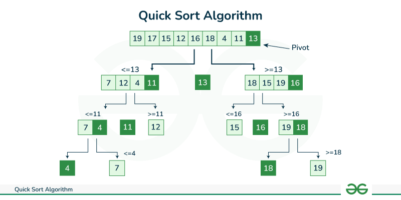

# Algoritmos de Ordenación

¡Bienvenidos a este capítulo fundamental en la ciencia de la computación y la programación con R! La ordenación de datos es una de las operaciones más comunes y críticas que realizamos. Desde organizar una tabla de datos por una columna específica hasta optimizar algoritmos más complejos, la capacidad de ordenar eficientemente es indispensable.

Comprender cómo funcionan los diferentes algoritmos de ordenación no solo mejora nuestra capacidad para escribir código eficiente, sino que también profundiza nuestra comprensión de la complejidad algorítmica, la eficiencia de los recursos y la lógica de programación.

En este capítulo, exploraremos algunos de los algoritmos de ordenación más conocidos y fundamentales: Burbuja (Bubble Sort), Inserción (Insertion Sort), Mergesort y Quicksort. Analizaremos su funcionamiento, implementaremos cada uno en R con bloques de código ejecutables y discutiremos sus características de rendimiento, incluyendo su complejidad temporal y espacial.

## Burbuja (Bubble Sort)

### Concepto

El algoritmo de ordenación por burbuja es uno de los más sencillos de entender e implementar. Su nombre proviene del hecho de que los elementos más "grandes" (o más "pesados", si imaginamos burbujas) "flotan" gradualmente hacia el final de la lista a medida que se realizan comparaciones y posibles intercambios.

El algoritmo funciona recorriendo repetidamente la lista, comparando cada par de elementos adyacentes y cambiándolos de posición si están en el orden incorrecto. Este proceso se repite hasta que ya no se necesiten intercambios en una pasada completa, lo que indica que la lista está ordenada.

### Implementación en R

A continuación, implementaremos `bubble_sort` en R.

```{r}
bubble_sort <- function(arr) {
  n <- length(arr)
  
  # Bucle exterior para cada pasada (n-1 pasadas como máximo)
  for (i in 1:(n - 1)) {
    swapped <- FALSE # Bandera para optimización: si no hay intercambios, está ordenado
    
    # Bucle interior para comparaciones y swaps
    # En cada pasada, el elemento más grande "burbujea" a su posición final
    # Por lo tanto, no necesitamos comparar los últimos i elementos
    for (j in 1:(n - i)) {
      if (arr[j] > arr[j + 1]) {
        # Intercambiar elementos
        temp <- arr[j]
        arr[j] <- arr[j + 1]
        arr[j + 1] <- temp
        swapped <- TRUE
      }
    }
    
    # Si no hubo intercambios en esta pasada, la lista está ordenada
    if (!swapped) {
      break
    }
  }
  return(arr)
}
```

### Explicación del Código

1.  **`bubble_sort(arr)`**: Nuestra función toma un vector `arr` como entrada.
2.  **`n <- length(arr)`**: Obtenemos la longitud del vector.
3.  **`for (i in 1:(n - 1))`**: Este bucle exterior controla el número de pasadas a través de la lista. En el peor de los casos, necesitaremos `n-1` pasadas para asegurar que todos los elementos estén en su lugar.
4.  **`swapped <- FALSE`**: Esta bandera es una optimización. Si una pasada completa no realiza ningún intercambio, significa que la lista ya está ordenada, y podemos salir del bucle exterior prematuramente.
5.  **`for (j in 1:(n - i))`**: Este bucle interior es el corazón del algoritmo. Recorre los elementos adyacentes.
    *   La condición `n - i` es crucial: después de la primera pasada (`i=1`), el elemento más grande ya está en la última posición. Después de la segunda pasada (`i=2`), los dos elementos más grandes están en las dos últimas posiciones, y así sucesivamente. Por lo tanto, no necesitamos comparar los últimos `i` elementos que ya están ordenados.
6.  **`if (arr[j] > arr[j + 1])`**: Compara si el elemento actual es mayor que el siguiente. Si lo es, están en el orden incorrecto.
7.  **Intercambio**: Si la condición es verdadera, se realiza un intercambio simple utilizando una variable temporal `temp`.
8.  **`if (!swapped) break`**: Si después de una pasada completa del bucle interior, `swapped` sigue siendo `FALSE`, significa que no se realizaron intercambios, y la lista ya está ordenada. Rompemos el bucle exterior para mejorar la eficiencia.
9.  **`return(arr)`**: La función devuelve el vector ordenado.

### Complejidad

*   **Tiempo**:
    *   **Peor caso**: O(n^2). Ocurre cuando el array está ordenado en orden inverso. Cada elemento necesita "burbujear" a través de casi toda la lista.
    *   **Caso promedio**: O(n^2).
    *   **Mejor caso**: O(n). Si el array ya está ordenado, la optimización con la bandera `swapped` hará que el algoritmo complete en una sola pasada.
*   **Espacio**: O(1). Es un algoritmo de ordenación "in-place" ya que solo utiliza una cantidad constante de memoria adicional para la variable `temp`.

### Ejemplo

Veamos `bubble_sort` en acción con algunos datos de ejemplo.

```{r}
# Ejemplo 1: Un vector desordenado
vector_desordenado <- c(5, 1, 4, 2, 8)
print(paste("Vector original:", paste(vector_desordenado, collapse = ", ")))
vector_ordenado <- bubble_sort(vector_desordenado)
print(paste("Vector ordenado (Bubble Sort):", paste(vector_ordenado, collapse = ", ")))

# Ejemplo 2: Un vector ya ordenado (para ver la optimización)
vector_ordenado_previo <- c(1, 2, 3, 4, 5)
print(paste("Vector original (ya ordenado):", paste(vector_ordenado_previo, collapse = ", ")))
vector_ordenado_opt <- bubble_sort(vector_ordenado_previo)
print(paste("Vector ordenado (Bubble Sort):", paste(vector_ordenado_opt, collapse = ", ")))

# Ejemplo 3: Un vector con elementos duplicados
vector_duplicados <- c(7, 2, 5, 2, 1, 9)
print(paste("Vector con duplicados:", paste(vector_duplicados, collapse = ", ")))
vector_ordenado_dup <- bubble_sort(vector_duplicados)
print(paste("Vector ordenado (Bubble Sort):", paste(vector_ordenado_dup, collapse = ", ")))
```

## Inserción (Insertion Sort)

### Concepto

El algoritmo de ordenación por inserción funciona de manera similar a cómo ordenaríamos un mazo de cartas en nuestra mano. Recorremos la lista elemento por elemento, tomando cada elemento y "insertándolo" en la posición correcta dentro de la parte ya ordenada de la lista.

La lista se divide conceptualmente en dos partes: una sublista ordenada (inicialmente solo el primer elemento) y el resto de elementos desordenados. En cada paso, se toma el primer elemento de la parte desordenada y se compara con los elementos de la sublista ordenada, desplazando los elementos mayores que él para hacer espacio y luego insertándolo en su posición correcta.

### Implementación en R

Implementaremos `insertion_sort` en R.

```{r}
insertion_sort <- function(arr) {
  n <- length(arr)
  
  # Itera desde el segundo elemento hasta el final
  for (i in 2:n) {
    key <- arr[i] # Elemento actual a insertar
    j <- i - 1     # Índice del último elemento de la sublista ordenada
    
    # Mueve los elementos de arr[0..i-1], que son mayores que key,
    # una posición adelante de su posición actual
    while (j >= 1 && arr[j] > key) {
      arr[j + 1] <- arr[j]
      j <- j - 1
    }
    
    # Inserta key en su posición correcta
    arr[j + 1] <- key
  }
  return(arr)
}
```

### Explicación del Código

1.  **`insertion_sort(arr)`**: Nuestra función toma un vector `arr` como entrada.
2.  **`n <- length(arr)`**: Obtenemos la longitud del vector.
3.  **`for (i in 2:n)`**: Este bucle exterior comienza desde el segundo elemento (`i=2`) porque asumimos que el primer elemento (`arr[1]`) ya es una sublista ordenada de un solo elemento.
4.  **`key <- arr[i]`**: `key` es el elemento actual que queremos insertar en la sublista ordenada.
5.  **`j <- i - 1`**: `j` es el índice del último elemento de la sublista ya ordenada.
6.  **`while (j >= 1 && arr[j] > key)`**: Este bucle `while` se encarga de:
    *   Comparar `key` con los elementos de la sublista ordenada (`arr[j]`).
    *   Si un elemento `arr[j]` es mayor que `key`, lo desplaza una posición a la derecha (`arr[j + 1] <- arr[j]`).
    *   `j` se decrementa para moverse hacia el inicio de la sublista ordenada, buscando el lugar correcto para `key`.
7.  **`arr[j + 1] <- key`**: Una vez que el bucle `while` termina (ya sea porque `j` llegó a 0 o porque `arr[j]` es menor o igual que `key`), significa que `j + 1` es la posición correcta para insertar `key`.
8.  **`return(arr)`**: La función devuelve el vector ordenado.

### Complejidad

*   **Tiempo**:
    *   **Peor caso**: O(n^2). Ocurre cuando el array está ordenado en orden inverso. Cada elemento debe ser comparado y desplazado a través de casi toda la sublista ordenada.
    *   **Caso promedio**: O(n^2).
    *   **Mejor caso**: O(n). Si el array ya está ordenado, cada elemento se compara solo con el elemento adyacente anterior, lo que resulta en un tiempo lineal.
*   **Espacio**: O(1). Es un algoritmo "in-place".

### Ejemplo

Veamos `insertion_sort` en acción.

```{r}
# Ejemplo 1: Un vector desordenado
vector_desordenado <- c(12, 11, 13, 5, 6)
print(paste("Vector original:", paste(vector_desordenado, collapse = ", ")))
vector_ordenado <- insertion_sort(vector_desordenado)
print(paste("Vector ordenado (Insertion Sort):", paste(vector_ordenado, collapse = ", ")))

# Ejemplo 2: Un vector pequeño
vector_pequeño <- c(4, 1, 3, 2)
print(paste("Vector pequeño:", paste(vector_pequeño, collapse = ", ")))
vector_ordenado_p <- insertion_sort(vector_pequeño)
print(paste("Vector ordenado (Insertion Sort):", paste(vector_ordenado_p, collapse = ", ")))
```

## Mergesort

### Concepto

Mergesort es un algoritmo de ordenación eficiente y estable que sigue el paradigma "divide y vencerás". Su principio es dividir el array de entrada en dos mitades, ordenar cada mitad recursivamente, y luego combinar (fusionar) las dos mitades ordenadas para producir el array final ordenado.

Los pasos principales son:
1.  **Dividir**: Si la lista tiene más de un elemento, divídela en dos sublistas aproximadamente iguales.
2.  **Conquistar**: Ordena recursivamente cada sublista utilizando Mergesort.
3.  **Combinar (Merge)**: Fusiona las dos sublistas ordenadas en una única lista ordenada. La fase de combinación es donde ocurre la mayor parte del trabajo.

La recursión termina cuando la sublista tiene un solo elemento, ya que una lista de un solo elemento se considera ordenada por definición.

### Implementación en R

Necesitaremos dos funciones: una para la lógica recursiva de división (`merge_sort`) y otra para la combinación de dos arrays ya ordenados (`merge_arrays`).

```{r}
# Función para combinar dos sub-arrays ordenados
merge_arrays <- function(left, right) {
  result <- c()
  
  # Mientras ambos arrays tengan elementos
  while (length(left) > 0 && length(right) > 0) {
    if (left[1] <= right[1]) {
      result <- c(result, left[1])
      left <- left[-1] # Elimina el primer elemento
    } else {
      result <- c(result, right[1])
      right <- right[-1] # Elimina el primer elemento
    }
  }
  
  # Añade los elementos restantes, si los hay
  if (length(left) > 0) {
    result <- c(result, left)
  }
  if (length(right) > 0) {
    result <- c(result, right)
  }
  
  return(result)
}

# Función principal de Mergesort
merge_sort <- function(arr) {
  n <- length(arr)
  
  # Caso base: un array con 0 o 1 elemento ya está ordenado
  if (n <= 1) {
    return(arr)
  }
  
  # Divide el array en dos mitades
  mid <- floor(n / 2)
  left_half <- arr[1:mid]
  right_half <- arr[(mid + 1):n]
  
  # Ordena recursivamente cada mitad
  sorted_left <- merge_sort(left_half)
  sorted_right <- merge_sort(right_half)
  
  # Combina las mitades ordenadas
  return(merge_arrays(sorted_left, sorted_right))
}
```

### Explicación del Código

#### `merge_arrays(left, right)`:
1.  **`result <- c()`**: Inicializamos un vector vacío para almacenar el resultado combinado.
2.  **`while (length(left) > 0 && length(right) > 0)`**: Este bucle compara los primeros elementos de `left` y `right`.
    *   El elemento más pequeño se añade a `result` y se elimina de su array original usando `left[-1]` o `right[-1]`. **Nota**: La eliminación de elementos al inicio de un vector en R es una operación costosa O(n) que puede impactar el rendimiento real de esta implementación en R. En lenguajes de bajo nivel se usarían punteros o índices.
3.  **`if (length(left) > 0)` / `if (length(right) > 0)`**: Después del bucle `while`, uno de los arrays podría tener elementos restantes (porque uno se agotó antes que el otro). Estos elementos restantes ya están ordenados y simplemente se añaden al final de `result`.
4.  **`return(result)`**: Devuelve el array combinado y ordenado.

#### `merge_sort(arr)`:
1.  **`n <- length(arr)`**: Obtiene la longitud del array.
2.  **`if (n <= 1)`**: Este es el **caso base** de la recursión. Si el array tiene 0 o 1 elemento, ya está ordenado, así que lo devolvemos tal cual.
3.  **`mid <- floor(n / 2)`**: Calcula el punto medio para dividir el array.
4.  **`left_half <- arr[1:mid]` y `right_half <- arr[(mid + 1):n]`**: Crea las dos sub-mitades del array.
5.  **`sorted_left <- merge_sort(left_half)` y `sorted_right <- merge_sort(right_half)`**: Llama recursivamente a `merge_sort` en cada mitad hasta que se alcanzan los casos base (arrays de un solo elemento).
6.  **`return(merge_arrays(sorted_left, sorted_right))`**: Una vez que las mitades se han ordenado recursivamente, se fusionan utilizando la función `merge_arrays`.

### Complejidad

*   **Tiempo**:
    *   **Peor caso**: O(n log n).
    *   **Caso promedio**: O(n log n).
    *   **Mejor caso**: O(n log n).
    Mergesort tiene un rendimiento consistente en todos los casos debido a su estrategia de división equitativa y la naturaleza de la operación de fusión. El factor `log n` viene de las divisiones recursivas, y `n` de la operación de fusión en cada nivel.
*   **Espacio**: O(n). Mergesort no es un algoritmo "in-place" puro. Requiere espacio adicional para almacenar las sublistas temporales durante la fase de fusión. En nuestra implementación de R, la creación de nuevos vectores en cada paso de `merge_arrays` contribuye a esta complejidad espacial.

### Ejemplo

Veamos `merge_sort` en acción.

```{r}
# Ejemplo 1: Un vector desordenado
vector_desordenado <- c(38, 27, 43, 3, 9, 82, 10)
print(paste("Vector original:", paste(vector_desordenado, collapse = ", ")))
vector_ordenado <- merge_sort(vector_desordenado)
print(paste("Vector ordenado (Mergesort):", paste(vector_ordenado, collapse = ", ")))

# Ejemplo 2: Un vector con elementos duplicados
vector_duplicados <- c(5, 2, 8, 2, 1, 5, 9)
print(paste("Vector con duplicados:", paste(vector_duplicados, collapse = ", ")))
vector_ordenado_dup <- merge_sort(vector_duplicados)
print(paste("Vector ordenado (Mergesort):", paste(vector_ordenado_dup, collapse = ", ")))
```

## Quicksort

### Concepto

Quicksort es un algoritmo de ordenación  creado por Tony Hoare en 1961 y se basa en el paradigma "divide y vencerás", siendo considerado uno de los algoritmos más rápidos en la práctica para grandes conjuntos de datos no estructurados. 
Aunque quicksort puede tener algunas desventajas, en la práctica funciona bien y supera a otros algoritmos de ordenación en velocidad y eficiencia espacial debido a su propóstio general. 

Basicamente se basa en la división y consquista que clasifica una matriz seleccionando un elemento "pivote" y dividiendo los otros elementos en dos subconjunyos, de acuerdo con si son menores o mayores que el pivote. Este proceso se repite recursivamente hasta que se clasifica la matriz [@dealgoritmo]. 

::: {.callout-note icon=false}
## 🗺️ El funcionamiento básico es el siguiente:
1.  **Elegir un Pivote**: Selecciona un elemento del array, llamado "pivote". La elección del pivote es crucial para el rendimiento.
2.  **Particionar**: Reordena el array de modo que todos los elementos con valores menores que el pivote queden a su izquierda, y todos los elementos con valores mayores queden a su derecha. Los elementos iguales al pivote pueden ir a cualquiera de los dos lados. Después de la partición, el pivote está en su posición final ordenada.
3.  **Recursión**: Aplica Quicksort recursivamente a la sublista de elementos con valores menores que el pivote y a la sublista de elementos con valores mayores que el pivote.

La recursión termina cuando una sublista tiene cero o un elemento, ya que ya están ordenados.
:::

# Quick_sort



Particion y pivote

1.  **Pivote**: Es el elemento alrededor del cual se divide la matriz, por ende, se puede elgir cualquier elemtno como pivote, pero las estrategias mcomunes incluyen la selección del primer elemento, el último elemento o un elemento aleatorio.

2. **Partición**: SU objetivo es mover todos los elementos más pequeños que el pivote a su izquierda y todos los elementos más grandes a su derecha. 

### Implementación en Java

::: {style="display: grid; grid-template-columns: 3fr 1fr; grid-gap: 18px;"}

::: {}
Implementaremos `quick_sort` en Java. Esta implementación es una versión 
simplificada que crea nuevos arrays en cada paso de la partición, lo cual 
es más fácil de entender pero menos eficiente en espacio que una 
implementación "in-place" con índices.
:::

::: {style="margin-left: 20px; margin-top: -15px;"}
{width=80%}
:::

:::


```java
public class QuickSort {
    
    public static int[] quick_sort(int[] arr) {
        int n = arr.length;
        
        # Caso base: un array con 0 o 1 elemento ya está ordenado
        if (n <= 1) {
            return arr;
        }
        
        # Elegir un pivote. Aquí usamos el último elemento por simplicidad.
        # Otras estrategias incluyen elegir el primero, el del medio, o un pivote aleatorio.
        int pivot_index = n - 1;
        int pivot = arr[pivot_index];
        
        # Separar los elementos menores y mayores que el pivote
        # Excluimos el pivote del array original antes de la partición
        int[] remaining_elements = new int[n - 1];
        for (int i = 0, j = 0; i < n; i++) {
            if (i != pivot_index) {
                remaining_elements[j++] = arr[i];
            }
        }
        
        # Utilizar un enfoque para la partición
        # Esto crea nuevos arrays, lo que impacta la eficiencia espacial
        # Contar elementos menores y mayores
        int lessCount = 0, greaterCount = 0;
        for (int num : remaining_elements) {
            if (num < pivot) {
                lessCount++;
            } else {
                greaterCount++;
            }
        }
        
        # Crear arrays para less y greater
        int[] less = new int[lessCount];
        int[] greater = new int[greaterCount];
        
        # Llenar los arrays
        int lessIdx = 0, greaterIdx = 0;
        for (int num : remaining_elements) {
            if (num < pivot) {
                less[lessIdx++] = num;
            } else {
                greater[greaterIdx++] = num; # >= para incluir iguales o mayores
            }
        }
        
        # Ordenar recursivamente las sublistas y combinar
        int[] sortedLess = quick_sort(less);
        int[] sortedGreater = quick_sort(greater);
        
        # Combinar: sortedLess + pivot + sortedGreater
        int[] result = new int[sortedLess.length + 1 + sortedGreater.length];
        System.arraycopy(sortedLess, 0, result, 0, sortedLess.length);
        result[sortedLess.length] = pivot;
        System.arraycopy(sortedGreater, 0, result, sortedLess.length + 1, sortedGreater.length);
        
        return result;
    }
}
```

### Explicación del Código

1.  **`quickSort(int[] arr)`**: Nuestra función toma un array de enteros `arr`.
2.  **`if (n <= 1)`**: El **caso base** de la recursión. Si el array tiene 0 o 1 elemento, se devuelve tal cual.
3.  **`pivot_index = n - 1` / `pivot = arr[pivot_index]`**: Elegimos el último elemento como pivote. Esta es una elección simple, pero puede llevar al peor caso si el array ya está ordenado o casi ordenado.
4.  **`remaining_elements`**: Creamos un nuevo array que contiene todos los elementos excepto el pivote.
5.  **`less y greater`**: Filtramos los elementos en dos arrays:
    *   **less**: elementos menores que el pivote
    *   **greater**: elementos mayores o iguales que el pivote
6.  **`sortedLess = quickSort(less) y sortedGreater = quickSort(greater)`**: Llamadas recursivas para ordenar cada subarray.
7.  **`return result`**: Esta es la fase de combinación.
    *   Concatena `sorteddLess`, el `pivot` y `sortedGreater` en un nuevo array.
    *   `System.arraycopy()` se usa para copiar eficientemente los elementos. 

### Complejidad del Algoritmo

*   **Complejidad temporal**:
    *   **Mejor caso**: (O(n log n)). Ocurre cuando el pivote divide el array en dos mitades aproximadamente iguales.
    *   **Caso promedio**: O(n log n). Con pivotes aleatorios o datos distribuidos uniformemente.
    *   **Peor caso**: O(n²): Cuando el pivote siempre es el elemento más pequeño o más grande.
*   **Complejidad espacial**:
    *   **O(n log n) en el peor caso**: Debido a que creamos nuevos arrays en cada nivel de recursión.
    *   Nuestra implementación en java, no es "in-place" por lo que utiliza más memoria que una versión optimizada con índices.

### Ejemplo

Veamos `quick_sort` en acción.

```java
# Ejemplo 1: Un vector desordenado
int[] vector_desordenado = {10, 80, 30, 90, 40, 50, 70};
System.out.print("Vector original: " + Arrays.toString(vector_desordenado));
int[] vector_ordenado = quick_sort(vector_desordenado);
System.out.print("Vector ordenado (Quicksort): " + Arrays.toString(vector_ordenado));

# Ejemplo 2: Un vector con números negativos
int[] vector_negativos = {-5, 3, -1, 8, 0, -10};
System.out.print("Vector con negativos: " + Arrays.toString(vector_negativos));
int[] vector_ordenado_neg = quick_sort(vector_negativos);
System.out.print("Vector ordenado (Quicksort): " + Arrays.toString(vector_ordenado_neg));
```

### Implementación en Python
::: {style="display: grid; grid-template-columns: 3fr 1fr; grid-gap: 18px;"}

::: {}
Implementaremos `quick_sort` en Java. Esta implementacion es una versión simplificada que crea nueva listas en cada paso de la partición, lo cual es más idiomático en Python pero menos eficiente en especio que una implementación "in-place" con índices.
:::

::: {style="margin-left: 20px; margin-top: -15px;"}
{width=80%}

:::

:::

```python
def quick_sort(arr):
    n = len(arr)
    
    # Caso base: una lista con 0 o 1 elemento ya está ordenada
    if n <= 1:
        return arr
    
    # Elegir un pivote. Aquí se usa el último elemento por simplicidad.
    # Otras estrategias incluyen elegir el primero, el del medio, o un pivote aleatorio.
    pivot_index = n - 1
    pivot = arr[pivot_index]
    
    # Separar los elementos menores y mayores que el pivote
    # Excluimos el pivote de la lista original antes de la partición
    remaining_elements = arr[:pivot_index] + arr[pivot_index + 1:]
    
    # Utilizar un enfoque Python-idiomático para la partición
    # Esto crea nuevas listas, lo que impacta la eficiencia espacial
    less = [x for x in remaining_elements if x < pivot]
    greater = [x for x in remaining_elements if x >= pivot]  # >= para incluir iguales o mayores
    
    # Ordenar recursivamente las sublistas y combinar
    return quick_sort(less) + [pivot] + quick_sort(greater)
```

### Explicación del Código

1.  **`quickSort(int[] arr)`**: Nuestra función toma una lista `arr`.
2.  **`if (n <= 1)`**: El **caso base** de la recursión. Si la lista tiene 0 o 1 elemento, se devuelve tal cual.
3.  **`pivot_index = n - 1` / `pivot = arr[pivot_index]`**: Elegimos el último elemento como pivote. Esta es una elección simple, pero puede llevar al peor caso si la lista ya está ordenada o casi ordenada.
4.  **`remaining_elements = arr [:pivot_index] + arr[pivot_index + 1]`**: Creamos una nueva lista que contiene todos los elementos excepto el pivote.
5.  **`less = [x for x in remaining_elements if x >= pivot]`**: Filtra los elementos que son mayores o iguales que el pivote, por ende, es importante incluir los iguales para evitar bucles infinitos en casos con duplicados si solo se usara **`>`** y el pivote fuera único.
7.  **`return quick_sort(less) + [pivot] + quick_sort(greater)`**: Esta es la fase de combinación
    *   Llama recursivamente a **quick_sort** en la sublista **`less`**
    *   EL **pivot** se coloca en medio, ya que está en su posición final
    *   Llama recursivamente a **`quick_sort`** en la sublista **`greater`**
    *   EL operador **`+`** concatena estas tres listas en la lista final ordenada.

### Complejidad del Algoritmo

*   **Complejidad temporal**:
    *   **Mejor caso**: O(n log n). Ocurre cuando el pivote divide la lista en dos mitades aproximadamente iguales
    *   **Caso promedio**: O(n log n). Con pivotes aleatorios o datos distribuidos uniformemente.
    *   **Peor caso**: O(n²): Ocurre cuando el pivote siempre es el elemento más pequeño o más grande 
*   **Complejidad espaciall**:
    *   **O(n log n) en el peor caso**: Debido a que creamos nuevas listas en cada nivel de recursión.
    *   Esta implementación no es "in-place", por lo que utiliza más memoria que una versión optimizada con índices.

### Ejemplo

Veamos `quick_sort` en acción.

```python
# Ejemplo 1: Una lista desordenada
vector_desordenado = [10, 80, 30, 90, 40, 50, 70]
print(f"Vector original: {vector_desordenado}")
vector_ordenado = quick_sort(vector_desordenado)
print(f"Vector ordenado (Quicksort): {vector_ordenado}")

# Ejemplo 2: Una lista con números negativos
vector_negativos = [-5, 3, -1, 8, 0, -10]
print(f"Vector con negativos: {vector_negativos}")
vector_ordenado_neg = quick_sort(vector_negativos)
print(f"Vector ordenado (Quicksort): {vector_ordenado_neg}")

# Ejemplo 3: Una lista con elementos duplicados
vector_duplicados = [5, 2, 8, 2, 5, 1, 8]
print(f"Vector con duplicados: {vector_duplicados}")
vector_ordenado_dup = quick_sort(vector_duplicados)
print(f"Vector ordenado (Quicksort): {vector_ordenado_dup}")
```

### Implementación en JavaScript
::: {style="display: grid; grid-template-columns: 3fr 1fr; grid-gap: 18px;"}

::: {}
Implementaremos `quick_sort` en JavaScript. Esta implementacion es unaversión simplificada que crea nuevos arrays en cada paso de la partición, lo cual es más idiomático en JavaScript pero menos eficiente en especio que una implementación "in-place" con índices.
:::

::: {style="margin-left: 20px; margin-top: -15px;"}
{width=80%}
:::
:::

```js
function quick_sort(arr) {
    const n = arr.length;
    
    # Caso base: un array con 0 o 1 elemento ya está ordenado
    if (n <= 1) {
        return arr;
    }
    
    # Elegir un pivote. Aquí se usa el último elemento por simplicidad.
    # Otras estrategias incluyen elegir el primero, el del medio, o un pivote aleatorio.
    const pivot_index = n - 1;
    const pivot = arr[pivot_index];
    
    # Separar los elementos menores y mayores que el pivote
    # Excluimos el pivote del array original antes de la partición
    const remaining_elements = arr.slice(0, pivot_index).concat(arr.slice(pivot_index + 1));
    
    # Utilizar un enfoque JavaScript-idiomático para la partición
    # Esto crea nuevos arrays, lo que impacta la eficiencia espacial
    const less = remaining_elements.filter(x => x < pivot);
    const greater = remaining_elements.filter(x => x >= pivot); # >= para incluir iguales o mayores
    
    # Ordenar recursivamente las sublistas y combinar
    return [...quick_sort(less), pivot, ...quick_sort(greater)];
}
```

### Explicación del Código

1.  **`quickSort(int[] arr)`**: Nuestra función toma una array `arr`.
2.  **`if (n <= 1)`**: El **caso base** de la recursión. Si el array tiene 0 o 1 elemento, se devuelve tal cual.
3.  **`pivot_index = n - 1` / `pivot = arr[pivot_index]`**: Elegimos el último elemento como pivote. Esta es una elección simple, pero puede llevar al peor caso si el array ya está ordenado o casi ordenado.
4.  **`remaining_elements`**: Creamos un array que contiene todos los elementos excepto el pivote usando **`slice()`** y **`concat()`** .
5.  **`less = remaining_elements.filter (x => x < pivot)`**: Usamoe el método **`filter()`** para obtener los elementos **`remaining_elements** que son menores que el pivote.
7.  **`greater = remaining_elements.filter(x => x >= pivot)`**: Filtra los elementos que son mayores o iguales que el pivote
8.  **`return [...quick_sort(less), pivot, ...quick_sort(greater)]`**: Esta es la fase de combinacion
    *   Llama recursivamente a **quick_sort** en la sublista **`less`**
    *   EL **pivot** se coloca en medio, ya que está en su posición final
    *   Llama recursivamente a **`quick_sort`** en la sublista **`greater`**
    *   EL operador spread **`...`** concatena estos tres resultados en el array final ordenado.

### Complejidad del Algoritmo

*   **Complejidad temporal**:
    *   **Mejor caso**: (O(n log n)). Ocurre cuando el pivote divide el array en dos mitades aproximadamente iguales
    *   **Caso promedio**: O(n log n). Con pivotes aleatorios o datos distribuidos uniformemente.
    *   **Peor caso**: O(n²): Ocurre cuando el pivote siempre es el elemento más pequeño o más grande 
*   **Complejidad espaciall**:
    *   **O(n log n) en el peor caso**: Debido a que creamos nuevas listas en cada nivel de recursión.
    *   Esta implementación no es "in-place", por lo que utiliza más memoria que una versión optimizada con índices.

### Ejemplo

Veamos `quick_sort` en acción.

```js
# Ejemplo 1: Una lista desordenada
const vector_desordenado = [10, 80, 30, 90, 40, 50, 70];
console.log(`Vector original: ${vector_desordenado}`);
const vector_ordenado = quick_sort(vector_desordenado);
console.log(`Vector ordenado (Quicksort): ${vector_ordenado}`);

# Ejemplo 2: Un array con números negativos
const vector_negativos = [-5, 3, -1, 8, 0, -10];
console.log(`Vector con negativos: ${vector_negativos}`);
const vector_ordenado_neg = quick_sort(vector_negativos);
console.log(`Vector ordenado (Quicksort): ${vector_ordenado_neg}`);

# Ejemplo 3: Un array con elementos duplicados
const vector_duplicados = [5, 2, 8, 2, 5, 1, 8];
console.log(`Vector con duplicados: ${vector_duplicados}`);
const vector_ordenado_dup = quick_sort(vector_duplicados);
console.log(`Vector ordenado (Quicksort): ${vector_ordenado_dup}`);
```
## Conclusión

Se ha recorrido cuatro algoritmos de ordenación fundamentales, cada uno con su enfoque único y características de rendimiento que definen su utilidad y eficiencia en el desarrollo de software moderno.

:::{.callout icon=false}
*   **Bubble Sort** e **Insertion Sort** Son algoritmos intuitivos y eficientes lo cual los hacen ideal para comprender la lógica de control de flujos, asi mismo, son adecuados para colecciones pequeñas o datos que ya estan casi ordenados ya que requieren un número minimo de intercambios.

    Sin embargo, su complejidad 0(n²) provoca que el tiempo de ejecución se dispare ante volúmenes de datos medianos o grandes por lo que su uso es nulo frente a alternativas más escalabes.

*   **Mergesort** y **Quicksort** Estos algoritmos representan la eficiencia del paradigma "divide y vencerás", la cual consiste en fragmentar el problema original en partes mas pequeñas logrando generalmente un rendimiento de **O(n log n)**. 

    *   **Mergesort** Es un algoritmo esable con una propiedad crítica cuando necesitamos que los elementos claves iguales mantengan su orden original. 
    
    *   **Quicksort** Este es un algoritmo reconocido por ser el más veloz en la práctica debido a su baja carga administrativa y el aprovechamiento de la caché del procesador.
    
    Al ser un algoritmo "in-place" es muy eficiente en el uso de memoria RAM donde depende de la elección del pivote, por lo que si escogemos mal la elección de datos ya ordenados puede degradar su rendimiento a **O(N²)**.
:::

No obstante, para la demostración de todos estos algoritmos de ordenación usamos 3 lenguajes de programación, en este caso fue java, pyhton y javascript. Aunque la sintaxis variaba un poco el comportamiento era el mismo, cada uno se centraba en estructuras estándar asegurando de no se altere el orden previo de elementos iguales, demostrando que al implementar estos algoritmos en distintos lenguajes no dependen simplemente de la herramienta, sino del dominio de la complejidad algorítmica y la gestión de los recursos del sistema.  
