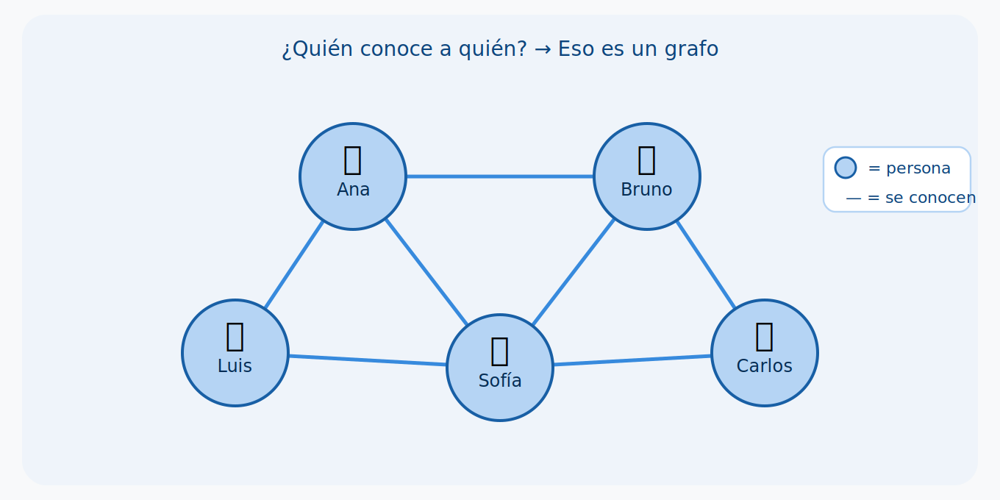
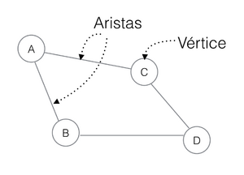
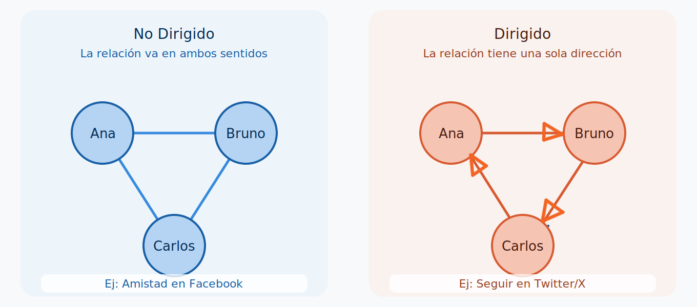
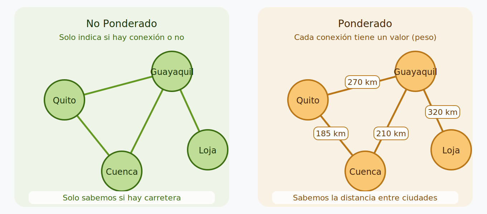
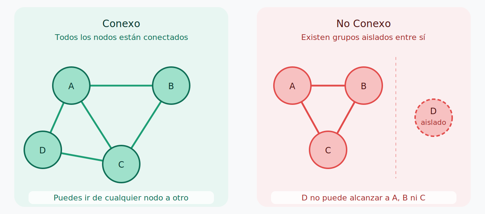
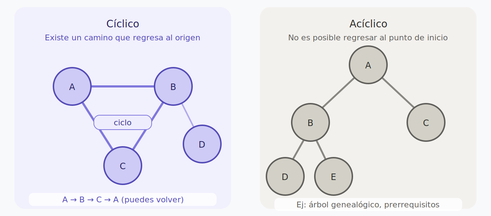

¡Hola a todos y bienvenidos a este capítulo sobre Estructuras No Lineales en R! En el mundo de la programación y el análisis de datos, no todo es una tabla bonita o un vector secuencial. A menudo, la información que manejamos tiene relaciones complejas, jerarquías o interconexiones que las estructuras de datos lineales simplemente no pueden representar de manera eficiente o intuitiva. Aquí es donde entran en juego los **grafos** y los **árboles binarios**.

::: {.callout-tip}
## ¿Por qué importa esto?
Piensa en cómo funciona Google Maps para encontrar la ruta más rápida entre tu casa y el trabajo, o cómo Facebook sugiere amigos que quizás conozcas. Ambos usan estructuras no lineales. Al finalizar este capítulo, entenderás los principios detrás de esas tecnologías.
:::

En este capítulo, además exploraremos cómo R nos permite trabajar con estas estructuras fundamentales, dotándonos de las herramientas para modelar y analizar datos con relaciones más intrincadas.


## Grafos: Tejiendo Redes de Relaciones

### ¿Qué es un grafo? 

Cuando una persona empieza a programar, normalmente aprende estructuras simples como
variables, arreglos y listas. Pero llega un momento donde necesitamos representar
**relaciones** entre elementos. Ahí es donde aparecen los **grafos**.

Imagina que tienes un grupo de amigos y quieres representar **quién se conoce con quién**.
Una forma sería hacer una lista:

- Ana conoce a Bruno
- Bruno conoce a Carlos
- Carlos conoce a Diana

Pero esa lista se vuelve imposible de leer cuando tienes muchas personas. Ahora imagina
que en cambio dibujas un **círculo por cada persona** y trazas una **línea entre los que
se conocen**. De repente puedes ver de un vistazo toda la red. **Eso es un grafo.**




## Definición formal de un grafo

::: {.callout-note icon="true"}
## Definición formal
Un **grafo** es una estructura matemática compuesta por un conjunto de **vértices**
(también llamados *nodos*) y un conjunto de **aristas** (también llamadas *enlaces*
o *conexiones*) que unen pares de vértices.[@cormen2022]

Se representa formalmente como **G = (V, A)**, donde:

- **V** es el conjunto de vértices → los "puntos" que representan entidades:
  personas, ciudades, páginas web, computadoras, etc.
- **A** es el conjunto de aristas → las "líneas" que unen dos vértices:
  relaciones, rutas, vínculos, dependencias, etc.[@cormen2022]
:::


### Sus dos componentes

**Los vértices** representan cualquier tipo de entidad:
personas, ciudades, computadoras, materias, lugares, páginas web.

**Las aristas** representan la relación entre esas entidades:
amistades, carreteras, comunicación, dependencias, hipervínculos.


::: {.callout-tip icon="true"}
##  Propiedades importantes de las aristas
- Pueden tener una **dirección** (grafos dirigidos) o no tenerla (grafos no dirigidos)
- Pueden tener un **peso numérico** que representa costo, distancia o tiempo
- Pueden tener **atributos adicionales** como etiquetas o categorías
- Una arista que conecta un vértice consigo mismo se llama **bucle** (*self-loop*)
- Dos vértices conectados por una arista se llaman **vértices adyacentes**

:::

**{height="20px" style="vertical-align:middle"} Python — estructura de un grafo**


```python
grafo = {
    "Ana":    ["Bruno", "Carlos"],
    "Bruno":  ["Ana",   "Diana"],
    "Carlos": ["Ana"],
    "Diana":  ["Bruno"]
}
print(grafo["Ana"])  # ['Bruno', 'Carlos']
```

 Cada clave es un **vértice** y su lista son los nodos con los que está conectado.


**{height="20px" style="vertical-align:middle"} Java — estructura de un grafo**


```java
Map> grafo = new HashMap<>();
grafo.put("Ana",    Arrays.asList("Bruno", "Carlos"));
grafo.put("Bruno",  Arrays.asList("Ana",   "Diana"));
grafo.put("Carlos", Arrays.asList("Ana"));
grafo.put("Diana",  Arrays.asList("Bruno"));
System.out.println(grafo.get("Ana")); // [Bruno, Carlos]
```

Cada clave es un **vértice** y su lista son los nodos con los que está conectado.


**{height="20px" style="vertical-align:middle"} JavaScript — estructura de un grafo**


```javascript
const grafo = {
    Ana:    ["Bruno", "Carlos"],
    Bruno:  ["Ana",   "Diana"],
    Carlos: ["Ana"],
    Diana:  ["Bruno"]
};
console.log(grafo["Ana"]); // ['Bruno', 'Carlos']
```

 Cada clave es un **vértice** y su lista son los nodos con los que está conectado.


### ¿Dónde aparecen los grafos en la vida real?

Los grafos están en todas partes, aunque no los llamemos así:

|Situación | ¿Qué son los vértices? |  ¿Qué son las aristas? |
|---|---|---|
| Red social (Instagram) | Usuarios | Quién sigue a quién |
| Google Maps | Intersecciones de calles | Calles o carreteras |
| Internet | Páginas web | Hipervínculos entre páginas |
| Red eléctrica | Transformadores o subestaciones | Cables de transmisión |
| Rutas aéreas | Aeropuertos | Vuelos directos disponibles |
| WhatsApp | Personas | Conversaciones entre ellas |
| Universidad | Materia | Prerrequisito |


::: {.callout-tip icon="true"}
##  Dato curioso
Cuando usas Google Maps y te dice *"en 20 minutos llegas"*, en realidad está
resolviendo un problema de grafos: busca el camino de menor peso (tiempo)
entre dos vértices (tu ubicación y tu destino) dentro de una red enorme de
intersecciones y calles. Todo eso sucede en milisegundos.[@cormen2022]
:::


### Conceptos clave que debes conocer

Antes de trabajar con grafos en R, hay algunos términos fundamentales:

- **Grado de un vértice**: número de aristas que tiene. En redes sociales,
  equivale a la cantidad de conexiones de una persona.
- **Camino**: secuencia de vértices conectados por aristas, como las paradas
  de un viaje en metro.
- **Ciclo**: un camino que empieza y termina en el mismo vértice.
- **Grafo conexo**: cuando existe al menos un camino entre cualquier par de vértices.
- **Componente**: subconjunto de vértices que están conectados entre sí pero
  aislados del resto del grafo.
- **Densidad**: proporción de aristas existentes respecto al total posible.
  Un grafo denso tiene muchas conexiones; uno disperso, pocas.

::: {.callout-important icon="true"}
## ¿Por qué son tan poderosos los grafos?
Porque enormes problemas del mundo real se reducen a preguntas sobre grafos:

- **¿Cuál es la ruta más corta?** → GPS, logística de entregas (Amazon, DHL)
- **¿Quién es la persona más influyente?** → Marketing, detección de epidemias
-  **¿Hay conexión entre A y B?** → Redes de computadoras, diagnóstico de fallos
-  **¿Cuáles son los grupos más unidos?** → Comunidades en redes sociales
-  **¿Cómo se propaga algo?** → Modelos de contagio de virus o rumores
-  **¿Cómo recomienda Netflix o Spotify?** → Grafos de preferencias de usuarios
:::
### Tipos de Grafos
No todos los grafos son iguales. Dependiendo de cómo sean las conexiones entre los
nodos, un grafo puede clasificarse de distintas formas. [@cormen2022]Entender estas diferencias
es clave porque cada tipo se usa para resolver problemas diferentes.


### Dirigido vs. No Dirigido

La primera gran distinción es si la relación entre dos nodos tiene **una dirección**
o si **va en ambos sentidos**.

::: {.callout-note icon="true"}
##  Grafo No Dirigido
Las aristas **no tienen dirección**. Si existe una conexión entre A y B,
entonces también existe entre B y A. La relación es completamente mutua.[@sedgewick2011]

**Ejemplos:**
- Amistad en Facebook: si eres amigo de alguien, esa persona también es tu amiga
- Carretera de doble vía: puedes ir y volver por el mismo camino
- Conexión WiFi: si tu laptop se conecta al router, el router también se conecta a tu laptop
:::

::: {.callout-note icon="true"}
## Grafo Dirigido
Las aristas **tienen una dirección específica**, representada con una flecha.
Que exista conexión de A hacia B no significa que exista de B hacia A.[@sedgewick2011]

**Ejemplos :**
- Seguir en Twitter/X: puedes seguir a una celebridad sin que ella te siga
- Correo electrónico: tú envías a alguien, pero esa persona no necesariamente te responde
- Transferencia bancaria: el dinero va de tu cuenta hacia otra, no al revés
:::



| No Dirigido |  Dirigido |
|---|---|
| Amistad en Facebook | Seguir en Twitter/X |
| Carretera de doble vía | Calle de un solo sentido |
| Conexión WiFi | Transferencia bancaria |
| Colaboración entre colegas | Correo electrónico enviado |


**{height="20px" style="vertical-align:middle"} Python — dirigido vs. no dirigido**


```python
# NO DIRIGIDO: Ana-Bruno es igual a Bruno-Ana
no_dirigido = {
    "Ana":   ["Bruno"],
    "Bruno": ["Ana"]
}

# DIRIGIDO: Ana sigue a Bruno, Bruno NO sigue a Ana
dirigido = {
    "Ana":   ["Bruno"],
    "Bruno": []
}
print(dirigido["Bruno"])  # []
```

 En el dirigido, `Bruno` no tiene conexiones de salida hacia `Ana`.


**{height="20px" style="vertical-align:middle"} Java — dirigido vs. no dirigido**


```java
// NO DIRIGIDO
Map> noDirigido = new HashMap<>();
noDirigido.put("Ana",   Arrays.asList("Bruno"));
noDirigido.put("Bruno", Arrays.asList("Ana"));

// DIRIGIDO
Map> dirigido = new HashMap<>();
dirigido.put("Ana",   Arrays.asList("Bruno"));
dirigido.put("Bruno", new ArrayList<>());
System.out.println(dirigido.get("Bruno")); // []
```

En el dirigido, `Bruno` no apunta de vuelta a `Ana`.


**{height="20px" style="vertical-align:middle"} JavaScript — dirigido vs. no dirigido**


```javascript
// NO DIRIGIDO
const noDirigido = { Ana: ["Bruno"], Bruno: ["Ana"] };

// DIRIGIDO
const dirigido = { Ana: ["Bruno"], Bruno: [] };
console.log(dirigido["Bruno"]); // []
```

 En el dirigido, `Bruno` no apunta de vuelta a `Ana`.


### Ponderado vs. No Ponderado

La segunda clasificación tiene que ver con si las aristas llevan un **valor numérico**
asociado o no.

::: {.callout-note icon="true"}
## Grafo No Ponderado
Las aristas solo indican **si existe o no** una conexión entre dos nodos.[@sedgewick2011]
No hay información adicional sobre esa conexión. Es como saber que dos ciudades
están conectadas por una carretera, sin saber cuántos kilómetros tiene.

**Ejemplos:**
- Lista de amigos: solo sabes si son amigos o no
- Mapa del metro: solo muestra qué estaciones están conectadas
:::

::: {.callout-note icon="true"}
## Grafo Ponderado
Cada arista tiene un **peso o valor numérico** que representa alguna característica[@cormen2022]
de esa conexión: distancia, tiempo, costo, intensidad, capacidad, etc.

**Ejemplos:**
- Google Maps: cada calle tiene un peso que representa el tiempo de viaje
- Tarifas aéreas: cada ruta tiene un precio diferente
- Red de internet: cada conexión tiene un ancho de banda distinto
:::




::: {.callout-tip icon="true"}
##  ¿Por qué importa el peso?
Cuando buscas la ruta más rápida en Google Maps, el algoritmo no busca
el camino con menos calles, sino el que tenga la **menor suma de pesos**
(menor tiempo total). Sin los pesos, todos los caminos serían equivalentes
y no habría forma de saber cuál es el más rápido.
:::


**{height="20px" style="vertical-align:middle"} Python — ponderado vs. no ponderado**


```python
# NO PONDERADO
no_ponderado = {
    "Quito": ["Guayaquil", "Cuenca"]
}

# PONDERADO: (destino, distancia en km)
ponderado = {
    "Quito": [("Guayaquil", 270), ("Cuenca", 185)]
}
print(ponderado["Quito"])  # [('Guayaquil', 270), ('Cuenca', 185)]
```

El peso `270` representa los kilómetros entre Quito y Guayaquil.


**{height="20px" style="vertical-align:middle"} Java — ponderado vs. no ponderado**


```java
// NO PONDERADO
Map> noPonderado = new HashMap<>();
noPonderado.put("Quito", Arrays.asList("Guayaquil", "Cuenca"));

// PONDERADO: arreglo {índice_destino, peso}
// Forma simple con String formateado
Map> ponderado = new HashMap<>();
ponderado.put("Quito", Arrays.asList("Guayaquil:270km", "Cuenca:185km"));
System.out.println(ponderado.get("Quito")); // [Guayaquil:270km, Cuenca:185km]
```

 El peso representa los kilómetros entre ciudades.


**{height="20px" style="vertical-align:middle"} JavaScript — ponderado vs. no ponderado**


```javascript
// NO PONDERADO
const noPonderado = { Quito: ["Guayaquil", "Cuenca"] };

// PONDERADO
const ponderado = {
    Quito: [{ destino: "Guayaquil", km: 270 },
            { destino: "Cuenca",    km: 185 }]
};
console.log(ponderado["Quito"]);
// [{destino: 'Guayaquil', km: 270}, {destino: 'Cuenca', km: 185}]
```

El peso `km` representa la distancia entre ciudades.


### Conexo vs. No Conexo

Este tipo describe si todos los nodos del grafo están **alcanzables entre sí**
o si existen grupos aislados.

::: {.callout-note icon="true"}
##  Grafo Conexo
Existe **al menos un camino** entre cualquier par de vértices del grafo.
Puedes ir de cualquier nodo a cualquier otro, aunque sea pasando por intermediarios.[@cormen2022]

**Ejemplo:** Una red de carreteras donde puedes viajar de cualquier ciudad
a cualquier otra, aunque sea con escalas.
:::

::: {.callout-note icon="true"}
##  Grafo No Conexo
Existen **grupos de nodos aislados** entre sí, llamados **componentes**.[@sedgewick2011]
Desde un componente no puedes llegar a otro siguiendo las aristas.

**Ejemplo:** Una isla sin puente ni ferry forma un componente desconectado
del resto de la red de carreteras del país.
:::





**{height="20px" style="vertical-align:middle"} Python — conexo vs. no conexo**


```python
# CONEXO: todos se alcanzan entre sí
conexo = {
    "A": ["B", "C"],
    "B": ["A", "C"],
    "C": ["A", "B"]
}

# NO CONEXO: X no tiene conexiones
no_conexo = {
    "A": ["B", "C"],
    "B": ["A", "C"],
    "C": ["A", "B"],
    "X": []           # Nodo aislado
}
print(no_conexo["X"])  # []
```

 `X` existe en el grafo pero no puede alcanzar a ningún otro nodo.


**{height="20px" style="vertical-align:middle"} Java — conexo vs. no conexo**


```java
Map> noConexo = new HashMap<>();
noConexo.put("A", Arrays.asList("B", "C"));
noConexo.put("B", Arrays.asList("A", "C"));
noConexo.put("C", Arrays.asList("A", "B"));
noConexo.put("X", new ArrayList<>());  // Nodo aislado
System.out.println(noConexo.get("X")); // []
```

 `X` existe en el grafo pero no puede alcanzar a ningún otro nodo.


**{height="20px" style="vertical-align:middle"} JavaScript — conexo vs. no conexo**


```javascript
const noConexo = {
    A: ["B", "C"],
    B: ["A", "C"],
    C: ["A", "B"],
    X: []            // Nodo aislado
};
console.log(noConexo["X"]); // []
```

 `X` existe en el grafo pero no puede alcanzar a ningún otro nodo.


###  Cíclico vs. Acíclico

La última clasificación básica tiene que ver con si es posible **recorrer un camino
que regrese al punto de partida** sin repetir aristas.

::: {.callout-note icon="true"}
## Grafo Cíclico
Contiene al menos un **ciclo**: un camino que comienza y termina en el mismo
vértice sin repetir aristas.[@sedgewick2011]

**Ejemplo:** En un mapa de ciudad, si puedes salir de tu casa, dar vuelta
por varias calles y regresar al punto de partida sin repetir ninguna calle,
existe un ciclo.
:::

::: {.callout-note icon="true"}
## Grafo Acíclico
**No contiene ningún ciclo**. Una vez que sales de un nodo siguiendo
las aristas, no hay manera de volver a él.[@sedgewick2011]

**Ejemplo:** Un árbol genealógico es acíclico: no puedes ser tu propio
abuelo. Las dependencias entre materias de una carrera también son
acíclicas: no puede ser que la materia A requiera la materia B
y al mismo tiempo B requiera A.
:::



::: {.callout-tip icon="true"}
## Los grafos acíclicos dirigidos tienen nombre propio
Un **DAG** (*Directed Acyclic Graph*) es un grafo dirigido y sin ciclos.
Son extremadamente útiles en la práctica: los usan herramientas como
**Git** para representar el historial de commits, o los sistemas de
construcción de software para saber en qué orden compilar los módulos.[@sedgewick2011]
:::


### Resumen visual

Un grafo puede combinar varias de estas características al mismo tiempo:

| Característica | Opción A | Opción B |
|---|---|---|
| **Dirección** | No dirigido (↔) | Dirigido (→) |
| **Pesos** | No ponderado | Ponderado |
| **Conectividad** | Conexo | No conexo |
| **Ciclos** | Cíclico | Acíclico |

> Por ejemplo, Google Maps usa un grafo **dirigido, ponderado y conexo**:
> las calles tienen sentido (dirigido), tienen tiempo de viaje (ponderado)
> y puedes llegar a cualquier lugar (conexo).


**{height="20px" style="vertical-align:middle"} Python — cíclico vs. acíclico**


```python
# CÍCLICO: A → B → C → A (regresa al inicio)
ciclico = {
    "A": ["B"],
    "B": ["C"],
    "C": ["A"]   # Regresa a A
}

# ACÍCLICO: no hay forma de volver al inicio
aciclico = {
    "A": ["B", "C"],
    "B": ["D"],
    "C": [],
    "D": []
}
print(ciclico["C"])   # ['A']  → hay ciclo
print(aciclico["D"])  # []     → sin ciclo
```

En el cíclico, `C` apunta de vuelta a `A` cerrando el ciclo.


**{height="20px" style="vertical-align:middle"} Java — cíclico vs. acíclico**


```java
// CÍCLICO
Map> ciclico = new HashMap<>();
ciclico.put("A", Arrays.asList("B"));
ciclico.put("B", Arrays.asList("C"));
ciclico.put("C", Arrays.asList("A")); // Regresa a A
System.out.println(ciclico.get("C")); // [A]

// ACÍCLICO
Map> aciclico = new HashMap<>();
aciclico.put("A", Arrays.asList("B", "C"));
aciclico.put("B", Arrays.asList("D"));
aciclico.put("C", new ArrayList<>());
aciclico.put("D", new ArrayList<>());
System.out.println(aciclico.get("D")); // []
```

 En el cíclico, `C` apunta de vuelta a `A` cerrando el ciclo.


**{height="20px" style="vertical-align:middle"} JavaScript — cíclico vs. acíclico**


```javascript
// CÍCLICO
const ciclico  = { A: ["B"], B: ["C"], C: ["A"] };

// ACÍCLICO
const aciclico = { A: ["B", "C"], B: ["D"], C: [], D: [] };

console.log(ciclico["C"]);   // ['A'] → hay ciclo
console.log(aciclico["D"]);  // []    → sin ciclo
```

 En el cíclico, `C` apunta de vuelta a `A` cerrando el ciclo.

##  Grafos en R: El Paquete `igraph`

Ahora que ya entendemos qué es un grafo y sus tipos, es momento de llevarlo a la
práctica en R. El paquete estrella para trabajar con grafos es `igraph`: una biblioteca
extremadamente eficiente con todo lo que necesitas para crear, visualizar y analizar
redes de cualquier tamaño.

::: {.callout-tip icon="true"}
##  ¿Por qué igraph?
`igraph` no es solo para R, también existe para Python y C. Es usado en investigación
científica, análisis de redes sociales, bioinformática y muchas otras áreas.
Su gran ventaja es que puede manejar grafos con **millones de nodos** sin perder
rendimiento.[@kolaczyk2020]
:::

### Instalación y carga

```r
# Instalar igraph (solo la primera vez)
install.packages("igraph")

# Cargar el paquete
library(igraph)
```


### Forma 1: Crear un grafo desde una lista de conexiones

La forma más intuitiva de crear un grafo es simplemente escribir qué nodos
están conectados entre sí. Es como decirle a R: *"A se conecta con B, B con C..."*

```r
# El operador - indica conexión entre dos nodos
# Como es no dirigido, A-B es igual a B-A
g1 <- graph_from_literal(A-B, B-C, C-D, D-A, B-D, A-C)
print(g1)
```

La salida muestra `UN--` que significa:
- **U** → *Undirected* (no dirigido)
- **N** → *Named* (los nodos tienen nombres)
- 4 vértices y 6 aristas

Podemos visualizarlo fácilmente:

```r
plot(g1,
     vertex.color = "lightblue",   # Color de los nodos
     vertex.size  = 40,            # Tamaño de los nodos
     edge.color   = "gray50",      # Color de las aristas
     main         = "Mi primer grafo en R")
```

::: {.callout-note icon="true"}
##  Personalización de `plot()`
`plot()` para `igraph` es muy versátil. Algunos argumentos útiles:

| Argumento | ¿Qué controla? |
|---|---|
| `vertex.color` | Color de los nodos |
| `vertex.size` | Tamaño de los nodos |
| `vertex.label.cex` | Tamaño del texto en nodos |
| `edge.color` | Color de las aristas |
| `edge.width` | Grosor de las aristas |
| `layout` | Disposición visual del grafo |
:::


### Forma 2: Crear un grafo desde una matriz de adyacencia

Una **matriz de adyacencia** es una tabla donde cada fila y columna representa
un nodo. Si el valor es `1`, hay conexión; si es `0`, no la hay.[@kolaczyk2020]

Piénsala como una tabla de "¿se conocen?" entre todos los integrantes de un grupo:

```
     V1  V2  V3  V4
V1 [  0   1   1   0 ]
V2 [  1   0   1   1 ]
V3 [  1   1   0   1 ]
V4 [  0   1   1   0 ]
```

```r
adj_matrix <- matrix(c(0, 1, 1, 0,
                       1, 0, 1, 1,
                       1, 1, 0, 1,
                       0, 1, 1, 0),
                     nrow = 4, byrow = TRUE)

g2 <- graph_from_adjacency_matrix(adj_matrix, mode = "undirected")

# Asignar nombres a los vértices
V(g2)$name <- c("V1", "V2", "V3", "V4")

plot(g2,
     vertex.color = "lightyellow",
     vertex.size  = 40,
     main         = "Grafo desde Matriz de Adyacencia")
```

::: {.callout-note icon="true"}
##  ¿Cuándo usar una matriz de adyacencia?
La matriz de adyacencia es útil cuando ya tienes los datos en formato de tabla,
por ejemplo datos de correlación entre variables, o una tabla de interacciones
entre elementos. Con grafos muy grandes puede consumir mucha memoria,
ya que guarda todos los ceros también.[@kolaczyk2020]
:::


### Forma 3: Crear un grafo desde un data frame

Esta es la forma más común en análisis de datos reales. Si tienes una tabla
con columnas `from` y `to`, puedes convertirla directamente en un grafo.[@kolaczyk2020]

Imaginemos que tenemos datos de una red social, con información de quién sigue a quién:

```r
# Data frame con las conexiones
red_social <- data.frame(
  from = c("Alice", "Bob", "Charlie", "David", "Eve", "Alice", "Charlie"),
  to   = c("Bob", "Charlie", "David", "Eve", "Alice", "Charlie", "Eve")
)

# directed = TRUE porque "Alice sigue a Bob" ≠ "Bob sigue a Alice"
g3 <- graph_from_data_frame(red_social, directed = TRUE)

plot(g3,
     main             = "Red Social Dirigida",
     layout           = layout_nicely(g3),
     vertex.color     = "salmon",
     vertex.size      = 35,
     edge.arrow.size  = 0.5,
     edge.color       = "gray40")
```

::: {.callout-tip icon="true"}
##  `layout_nicely()` vs otros layouts
`igraph` ofrece varios algoritmos para distribuir los nodos visualmente:

| Layout | ¿Cuándo usarlo? |
|---|---|
| `layout_nicely()` | Deja que igraph elija el mejor |
| `layout_in_circle()` | Todos los nodos en círculo |
| `layout_as_tree()` | Para grafos jerárquicos |
| `layout_with_fr()` | Redes medianas, aspecto orgánico |
| `layout_with_kk()` | Redes pequeñas, muy ordenado |
:::


### Resumen: ¿Qué forma usar según tu situación?

| Tengo... | Función a usar |
|---|---|
| Una lista de conexiones escrita a mano | `graph_from_literal()` |
| Una matriz de 0s y 1s | `graph_from_adjacency_matrix()` |
| Un data frame con columnas from/to | `graph_from_data_frame()` |

## Propiedades y Análisis de Grafos

Usaremos como ejemplo una red social pequeña con cinco personas:

**1-Alice, 2- Bob 3-Carol, 4-Dave, 5-Eve**

**Alice -> Bob, Alice -> Dave, Bob -> Carol, Bob -> Eve, Dave -> Carol, Dave -> Eve, Carol -> Eve**.

Una vez que tenemos nuestro grafo, podemos consultar:


### ¿Cuántos vértices y aristas tiene el grafo?

Lo más básico: contar nodos y conexiones.

```r
vcount(g3)  # Número de personas en la red  = 5
ecount(g3)  # Número de conexiones          = 7
```


### ¿Cuántas conexiones tiene cada persona? — Grado (`degree`)

El **grado** de un vértice es cuántas conexiones tiene.[@gutierrez2024introduccion]
En un grafo **dirigido** (las aristas tienen dirección, como en las redes sociales),
distinguimos dos tipos:

| Tipo | Significado | Analogía                  |
|---|---|---|
| `in-degree` | Conexiones que **llegan** al nodo | Cuántas personas te siguen a ti |
| `out-degree` | Conexiones que **salen** del nodo | A cuántas personas sigues tú |
| `all` | Suma de ambas | Actividad total en la red |

```r
degree(g3, mode = "in")   # ¿Quién tiene más seguidores? (popularidad)
degree(g3, mode = "out")  # ¿Quién sigue a más personas? (actividad)
degree(g3, mode = "all")  # Grado total
```

**Resultado para nuestra red:**

```
in-degree:  Alice=0  Bob=1  Carol=2  Dave=1  Eve=3
out-degree: Alice=2  Bob=2  Carol=1  Dave=2  Eve=0
all:        Alice=2  Bob=3  Carol=3  Dave=3  Eve=3
```

::: {.callout-note}
## Interpretación
- **Eve** tiene `in-degree = 3`: ella es la más popular.
- **Alice** tiene `out-degree = 2` pero `in-degree = 0`: ella sigue a otros pero nadie la sigue.
- **Eve** tiene `out-degree = 0`: recibe información pero no la transmite.[@gutierrez2024introduccion]
:::


### ¿Están todos conectados entre sí? — Componentes conectados

Un **componente conectado** es un grupo de vértices donde todos se pueden
alcanzar entre sí (aunque sea pasando por intermediarios).
Si hay nodos aislados o subgrupos desconectados, cada uno forma su propio componente.[@gutierrez2024introduccion]

```r
components(g1)
# $membership  → a qué componente pertenece cada vértice
# $csize        → tamaño de cada componente
# $no           → número total de componentes
```

**Ejemplo:**

Imagina una red de WhatsApp donde bloqueas a alguien.
Ese bloqueo puede dividir la red en dos grupos que ya no se comunican entre sí:
cada grupo sería un componente separado.

```r
# Si el grafo tiene un solo componente:
components(g1)$no  # → 1  (todos están conectados)

# Si hay nodos aislados:
components(g1)$no  # → 3  (hay 3 subgrupos desconectados)
```

::: {.callout-tip}
## ¿Para qué sirve?
Los componentes desconectados son comunidades que no tienen
contacto entre sí. La información no puede saltar entre componentes sin un puente.
:::


### ¿Cuál es el camino más corto entre dos personas? — `shortest_paths()`

Inspirado en el famoso experimento de los **"seis grados de separación"**
(la idea de que cualquier persona del mundo está conectada a cualquier otra en ≤ 6 pasos),
esta función encuentra la ruta con el menor número de saltos entre dos nodos.[@vieites2014teoria]

```r
shortest_paths(g3,
               from   = "Alice",
               to     = "Eve",
               output = "vpath")$vpath[[1]]
```

**Resultado:**

```
Alice → Bob → Eve     (2 saltos)
```

También existe la ruta `Alice → Dave → Eve` con la misma longitud.
`shortest_paths()` devuelve una de ellas; si quieres todas, usa `all_shortest_paths()`.

::: {.callout-note}
## Interpretación
Cuanto más corto el camino, más "cercanas" están dos personas en la red,
aunque no se conozcan directamente.
:::


### ¿Quién es el más "influyente" o "central"? — Métricas de centralidad

Existen distintas formas de medir la importancia de un nodo en la red
y cada una responde una pregunta diferente.

#### Centralidad de intermediación — `betweenness()`

 **Pregunta: ¿Por cuántos caminos más cortos pasa este nodo?**

Un nodo con **betweenness alto** es un *puente* o *intermediario* crítico.[@vieites2014teoria]
Si lo eliminas, muchas comunicaciones se rompen.

```r
betweenness(g3, normalized = TRUE)
```

**Resultado aproximado:**

```
Alice=0.00  Bob=0.33  Carol=0.10  Dave=0.33  Eve=0.00
```

**Interpretación:** Bob y Dave tienen el betweenness más alto porque
la mayoría de los caminos más cortos entre otros pares de nodos pasan por ellos.
Alice y Eve están en los extremos: Alice es origen, Eve es destino, pero ninguna
actúa como puente.[@vieites2014teoria]

::: {.callout-tip}
## Analogía
El empleado con mayor betweenness es quien conecta diferentes departamentos.
Si renuncia, la comunicación interna se fragmenta.
:::

#### Centralidad de cercanía — `closeness()`

**Pregunta: ¿Qué tan rápido puede este nodo alcanzar a todos los demás?**

Un nodo con **closeness alto** puede difundir información rápidamente a toda la red
porque está "cerca" (en número de saltos) de todos los demás.[@vieites2014teoria]

```r
closeness(g3, normalized = TRUE)
```

**Resultado aproximado:**

```
Alice=0.80  Bob=0.65  Carol=0.40  Dave=0.60  Eve=0.00
```

**Interpretación:**
- **Alice** tiene el closeness más alto: puede llegar a todos en pocos pasos.
- **Eve** tiene closeness = 0: no tiene aristas salientes, no puede "llegar" a nadie.

::: {.callout-tip}
## Analogía
El almacén con mayor closeness es el que tiene mejor ubicación geográfica
para distribuir mercancía a todos los puntos de entrega en el menor tiempo posible.
:::


### Comparación

| Métrica | Pregunta  | Ejemplo  |
|---|---|---|
| **Degree** | ¿Cuántas conexiones tiene? | Influencer con muchos seguidores |
| **Betweenness** | ¿Por cuántos caminos pasa? | Empleado puente entre departamentos |
| **Closeness** | ¿Qué tan cerca está de todos? | Almacén con mejor ubicación |


::: {.callout-tip}
## ¿Para qué sirven estas métricas en la práctica?

- **Epidemiología:** identificar a las personas con mayor betweenness para romper
  cadenas de contagio con vacunación focalizada.
- **Marketing:** encontrar los influencers clave (alto degree + alto closeness)
  para campañas virales.
- **Logística:** ubicar centros de distribución óptimos (máximo closeness).
- **Seguridad informática:** detectar nodos críticos cuya caída colapsaría
  la red (alto betweenness).
- **Ciencias sociales:** entender quién tiene poder informal en una organización,
  más allá del organigrama oficial.[@vieites2014teoria]
:::


## Reto de Programación: Red de Conexiones de la Universidad

::: {.callout-tip}
## Objetivo del reto

Representar y analizar una red de lugares del campus usando un **grafo no dirigido**.

 **Contexto**

En la universidad existen los siguientes lugares:
- Biblioteca  
- Cafetería  
- Laboratorios  
- Aula Magna  
- Canchas  
- Entrada principal  

Estos lugares están conectados entre sí por caminos.

 **Conexiones del grafo**

- Biblioteca ↔ Cafetería  
- Cafetería ↔ Laboratorios  
- Laboratorios ↔ Aula Magna  
- Aula Magna ↔ Canchas  
- Canchas ↔ Entrada principal  
- Entrada principal ↔ Biblioteca  

 **Tareas**

1. Representar el grafo usando una **lista de adyacencia**.
2. Mostrar conexiones  
Ejemplo:
```
Biblioteca -> Cafetería, Entrada principal  
Cafetería -> Biblioteca, Laboratorios 
``` 
3. Verificar conexión directa  
El usuario ingresa dos lugares y el programa responde:  
- Sí están conectados directamente  
- No están conectados directamente  
4. Recorrido del grafo  
Realizar un recorrido desde un nodo inicial usando **BFS o DFS**.  

Ejemplo:  
```
Inicio: Biblioteca  
Salida: Biblioteca → Cafetería → Laboratorios → Aula Magna → Canchas → Entrada principal  
```

 **Reglas**
- Grafo no dirigido  
- Sin bases de datos (solo memoria)  
- Lenguajes permitidos: Python, Java o JavaScript  
:::


## Conclusión

Hemos recorrido un camino fascinante por el mundo de las estructuras no lineales en R. Los **grafos**, con el soporte excepcional del paquete `igraph`, nos permiten modelar y analizar sistemas complejos donde las relaciones son primordiales, desde redes sociales hasta interacciones biológicas. Los **árboles binarios**, aunque su implementación en R a nivel de estructura de datos pura puede requerir un enfoque más "manual" o específico, son fundamentales para entender cómo se organizan y procesan los datos de forma jerárquica, subyaciendo a muchos algoritmos de búsqueda y toma de decisiones.

Dominar estas estructuras amplía enormemente su capacidad para abordar problemas de datos más complejos y estructurados. Sigan experimentando con `igraph` y, si se sienten aventureros, intenten implementar algoritmos básicos de árboles binarios en R para solidificar su comprensión.

¡Hasta la próxima!